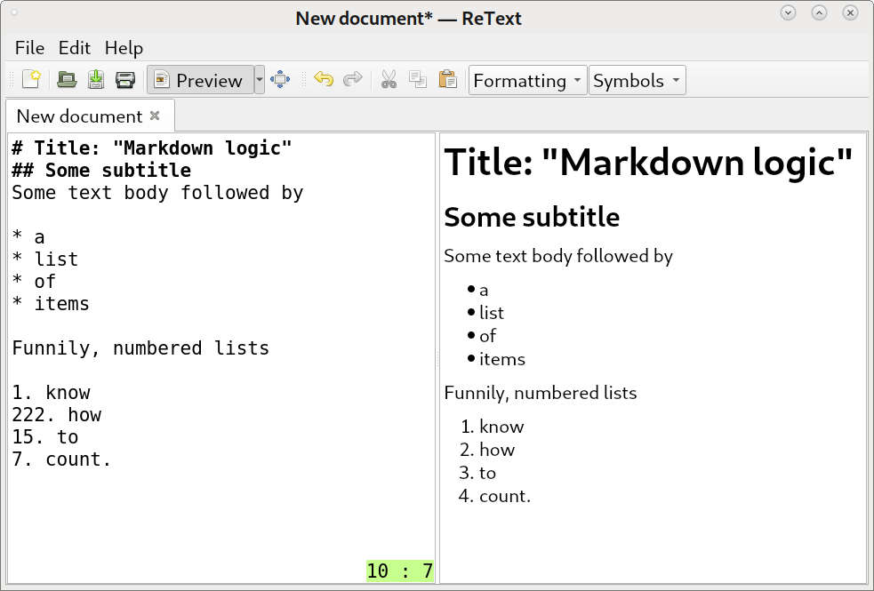
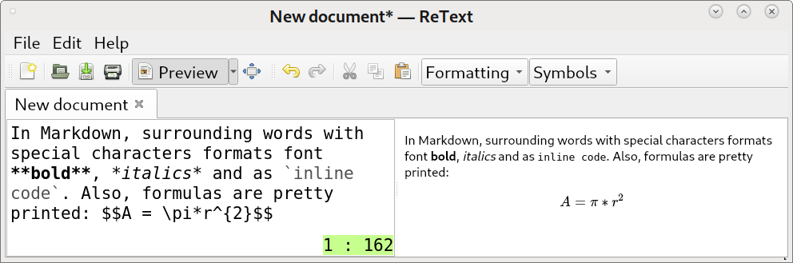
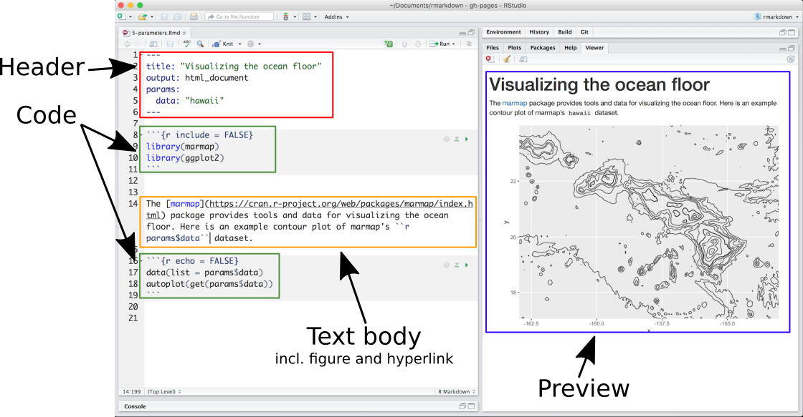
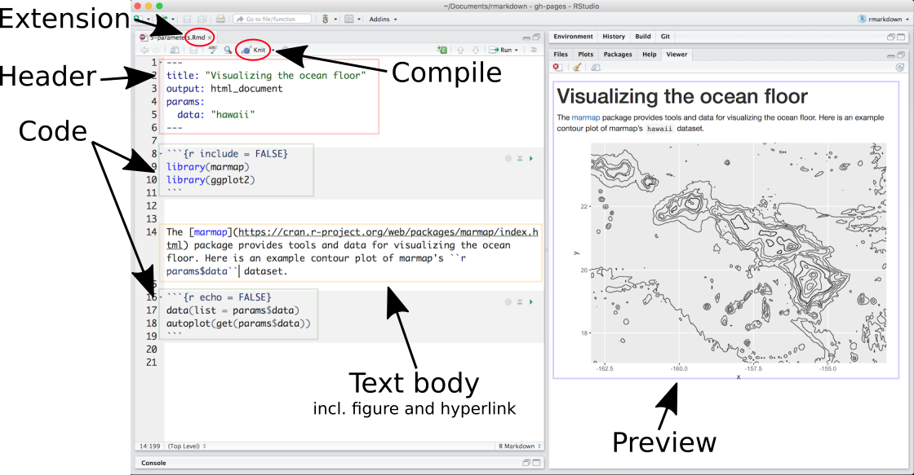

# What is Markdown?
- Markup language

{ width=90% }\


# What is Markdown?
{ width=90% }\


# What is R Markdown?
- R/RStudio flavored markdown language
- Developed by [RStudio](www.rstudio.com)
- Generate reports that include (and execute) scripts 
- Export to multiple formats (pdf, html, MS Word etc.)
- Multiple language support (R, Python, SQL etc.)


# Benefits
- Reproducibility
- Project sharing
- High quality reports


# Overview
{ width=100% }\


# Overview
{ width=100% }\


# Examples
Unordered lists are easily generated

* with
* asterisks
- or 
- dashes.

Ordered lists are

1) preceded
111) by
0) any
0) number.


<!-- Type three asterisks for a newpage -->
***

Surrounding text by special characters formats it as **bold**, *italics* or `as inline code` and formulas are pretty printed in math mode $A = \pi*r^{2}$.


Also tables have a simple formatting scheme:


| Right | Left | Default | Center |
|------:|:-----|-|:------:|
| 12 | 12 | 12 | 12 |
| 123 | 123 | 123 | 123 |
| 1 | 1 | 1 | 1 |


# Examples with R
```{r}
## Set a constant for random number generation
set.seed(29899)

## Create normally distributed values
norm <- rnorm(100, mean = 0, sd = 1)
summary(norm)
```


# Plot random numbers
```{r}
hist(norm, main = "")
```


# Same with hidden code chunks
```{r, echo = FALSE}
norm <- rnorm(1000, mean = 0, sd = 1)
summary(norm)
hist(norm, main = "")
```


# More options
Parameter | Default | Function |
|:------|:-----|:---------|
eval | TRUE | Run code and output results? |
include | TRUE | Output code and results? |
echo | TRUE | Show code  with the results? |
warning | TRUE | Show warnings? |
error | FALSE | Show error messages? |
message | TRUE | Show messages? |
tidy | FALSE | "Tidy" code? |
cache | FALSE | Cache results? |
comment | "##" | Character for comments |
fig.width, fig.height | 7 | Figure width/height (in inches) |
fig.align | fig.align="left" | "left" "right" "center" |
<!-- results | "markup" | How to treat results? "hide" = no results, "asis" = results without formatting, "hold" = results only compiled at end of chunk (use if many commands act on one object) | -->


# Convert R objects to tables
```{r}
library(pander)

df <- data.frame(
  Plant = c("a", "b", "c"),
  Temperature = rep(20, 3),
  Growth = c(0.65, 0.95, 0.15))
emphasize.italics.cols(1) # italicize 1st column
pander(df) # print as table
```


