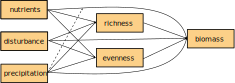

```{r setup, include=FALSE}
knitr::opts_chunk$set(echo = TRUE)
```


# Dataset
The data for following exercises stem from the publication [*Grassland ecosystem recovery after soil disturbance depends on nutrient supply rate*](https://onlinelibrary.wiley.com/doi/abs/10.1111/ele.13591) and are publicly available at [Dryad](https://datadryad.org/stash/dataset/doi:10.5061/dryad.83bk3j9pc).
The data were obtained during the long-term field experiment [Cedar Creek LTER](https://www.cedarcreek.umn.edu/) and target the effects of human disturbances on grassland ecosystem functioning and biodiversity.


## Load data
```{r}
rm(list = ls())
seabloom <- read.table("/home/r/Swiss_SEM/2_Modeling/Data_preparation/CedarCreek_Seabloom/seabloom-2020-ele-dryad-data/cdr-e001-e002-output-data.csv",
                       sep = ",", header = TRUE)
```


## Explore data
```{r}
dim(seabloom)
str(seabloom)
```

Exploring the data reveals 16 variables with each 5040 data points:

* `exp`: treatments in split-plot design: 1 = disturbance (Control or Disked, 35 × 55 m plots) and 2 = nutrient addition (9 levels, 4 × 4 m plots)
* `field`: three experimental fields A, B and C
* `plot`: 54 plots within fields
* `disk`: disking treatment (0 = intact at start of experiment, 1 = disked at start of experiment)
* `yr.plowed`: last year field was plowed for agriculture (A: 1968, B: 1957 and C: 1934)
* `ntrt`: nine levels representing different combinations of nitrogen (0 to 27.2 g N year^-1^ added as NH~4~NO~3~) and other nutrients (20 g m^−2^ year^−1^ P~2~0~5~; 20 g m^−2^ year^−1^ K~2~0; 40 g m^−2^ year^−1^ CaCO~3~; 30.0 g m^−2^ year^−1^ MgSO~4~; 18 μg m^−2^ year^−1^ CuSO~4~; 37.7 μg m^−2^ year^−1^ ZnSO~4~; 15.3 μg m^−2^ year^−1^ CoCO~2~; 322 μg m^−2^ year^−1^ MnCl~2~ and 15.1 μg m^−2^ year^−1^ NaMoO~4~; details see Table S1 in publication). Nutrients were applied twice per year in mid-May and mid-June.
- `nadd`: nitrogen additon rate (g/m^2^/yr)
- `other.add`: other nutrient treatment (0 = control, 1 = other nutrients added)
- `year`: sampling year
- `dur`: duration of experiment
* `precip.mm`: annual precipitation (mm)
* `precip.gs`: growing season precipitation (mm)
- `mass.above`: aboveground biomass (g/m^2^)
- `rich`: species richness (species/0.3 m^2^)
- `even`: Simpson's evenness
- `ens.pie`: effective number of species, (= probability of interspecific encounter	decimal	equivalent to inverse Simpson's diversity)
<!-- - `origin`: species origin (native or introduced) -->
<!-- - `duration`: species lifespan (annual, bienniel, perennial) -->
<!-- - `functional.group`: species functional group: -->
<!--   + `C3` = C3 grass -->
<!--   + `C4` = C4 grass -->
<!--   + `F` = forb -->
<!--   + `L` = legume -->
<!--   + `S` = sedge -->


## Disturbance treatment
The **disturbance treatment** was replicated in the three old-fields (A, B and C) in a completely randomised block design (two treatments in each of three fields for a total of 6 35 × 55 m large plots).
In April 1982, in each of the fields, one of these two 35 × 55 m areas was selected to be disturbed with a 45 cm diameter disk harrow pulled by a tractor 20 times in one direction, 20 times perpendicularly and 5 times diagonally to the first passes. Following the disking, the soil was hand raked to smooth the soil and remove any remaining vegetation, so that subsequent colonisation was solely from seeds or small rhizome fragments.
Within each of the 6 large plots, the 54 small plots were arrayed in 6 × 9 grid with 1 m buffers between each plot. Aluminium flashing was buried to depth of 30 cm around each plot to prevent horizontal movement of nutrients and spreading of plants through vegetative growth.


## Nutrient treatments
The **nutrient treatments** were replicated six times in a completely randomised design in each of the 35 × 55 m plots (54 4 × 4 m small plots) yielding `r 6 * 54` (6 x 54) plots.
The analyses focuses on two nutrient treatments:

1) Control (no nutrients; Treatment I) and
2) Other Nutrients and 9.5 g of N (Treatment F)


## Sampling and analysis
At peak biomass (mid-July to late August), all aboveground biomass was clipped in a 3 m by 10 cm strip (0.3 m^2^) in each plot. Note that there were 4 years when the disturbed plots were not sampled or only sampled in a single field. The biomass was sorted into dead, previous year’s growth (litter) and live, current year’s growth (live biomass). Live biomass was sorted to species, dried to constant mass at 40°C, and weighed to the nearest 0.01 g.
We estimated total aboveground biomass as the summed biomass of all non-woody species in each 0.3 m^2^ sample, converted to g m^-2^. We excluded woody biomass, because our goal was to estimate annual productivity and most of the woody biomass is from previous year’s growth. Woody plant biomass composed less than 1% of total biomass across the data set.

**Shorten this:** Species richness is the number of species in each 0.3 m^2^ sample.
We quantified plant diversity as the Effective Number of Species based on the Probability of Interspecific Encounter (ENS~PIE~), a measure of diversity that is more robust to the effects of sampling scale and less sensitive to the presence of
rare species than species richness (Jost, 2006, 2007; Chase and Knight, 2013).
ENS~PIE~ is equivalent to the Inverse Simpson’s index of diversity which is calculated as $1 / \sum_{i=1}^{S} p_i^2$  where S is the total number of species (i.e. species richness) and p~i~ is the proportion of the community biomass reesented by species i (Jost, 2006, 2007; Chase and Knight, 2013).
Simpson’s evenness (E) satisfies the main requirements of an evenness index (Smith and Wilson, 1996). In addition, it is directly related to ENS~PIE~ through the relationship E = ENS~PIE~/S (Smith and Wilson, 1996), thus we can factor diversity directly into its richness and evenness components through the relationship ENS~PIE~ = S*E.

<!-- Across all data, ENS~PIE~ was positively correlated with richness (r = 0.63) but uncorrelated with evenness (r = 0.03). Richness and evenness were negatively correlated (r = -0.60). -->

## Overview
The `pairs` function yields an overview over the numerical data. Beforehand, define a function to manipulate point size in the plot.

```{r}
panel.points <- function(x, y) {
  points(x, y, cex = 0.1)
  }

pairs(seabloom[, -c(1:3, 9)], lower.panel = NULL, upper.panel = panel.points)
```


# Metamodel
The [metamodel](https://en.wikipedia.org/wiki/Metamodeling) summarizes the concept behind the model.
Here, the metamodel is visualized as a [directed acyclic graph (DAG)](https://en.wikipedia.org/wiki/Directed_acyclic_graph) and reads as:
biomass is directly influenced by the environmental parameters nutrients, disturbance and precipitation on the one hand and richness and evenness on the other hand.
The three environmental parameters also influence richness and evenness and thus, also have an indirect effect on biomass via richness and evenness.
**Add this interaction thingy!**

{width=70%}


# Modeling
## Subset to one year
For simplicity, set the focus on only one year.

```{r}
seabloom <- seabloom[seabloom$year == 2000, ]
dim(seabloom)
```


## Linear model
First, implement the metamodel into a [linear model (LM)](https://en.wikipedia.org/wiki/Linear_model).
For this, three models are necessary: one that accounts for the direct- and two for the indirect effects. 

- visualisation as DAG
- residuals
- variance/covariance matrix
- Split up into several lms


### Direct effects
{width=45%}

```{r}
lm.dir <- lm(mass.above ~ nadd + disk + precip.mm + rich + even,
             data = seabloom)
summary(lm.dir)
```


### Indirect effects
Herein, two LMs are necessary: one for richness and one for evenness.

{width=90%}

```{r}
lm.rich <- lm(rich ~ nadd + disk + precip.mm, data = seabloom)
summary(lm.rich)

lm.even <- lm(even ~ nadd + disk + precip.mm, data = seabloom)
summary(lm.even)
```


## Simple SEM
This simple model shall illustrate the logic of SEM.
Comparability is eased as it contains the same variables as the linear model before.

- visualisation as DAG
- explain model output
- assessment of fit

{width=70%}


```{r}
library("lavaan")

sem1 <-
"mass.above ~ nadd + rich + even + disk
rich ~ nadd
even ~ nadd"

fit.sem1 <- sem(sem1, data = seabloom)
```


### Scale variables
To reduce the difference in variances between the variables, we rescale them setting the mean to zero and the variance to one.
```{r}
seabloom[, c(4, 7, 13:15)] <- apply(seabloom[, c(4, 7, 13:15)], 2, scale)


fit.sem1 <- sem(sem1, data = seabloom)
summary(fit.sem1, rsq = TRUE)
```


The model converged with poor fit:

- The ratio of the test statistic and the degrees of freedem should be **smaller than 2** (this ratio gives an indication how far away the model is from a decent fit)
- p-value should be larger than 0.05


### Modification indices
To improve the model we look for missing paths.

```{r}
modindices(fit.sem1, minimum.value = 3)
```

In the column `mi` (modification index) we look for high values...
Highest values are between `rich` and `even` and therefore, we include a correlation between them.

```{r}
fit.sem1.up <- update(fit.sem1, add = "rich ~~ even")
summary(fit.sem1.up, rsq = TRUE, fit.measures=T)

# standardizedsolution(fit.sem1.up)
# inspect(fit.sem1.up, "r2")
```

### Plot the model
```{r}
library(lavaanPlot)

lavaanPlot(model = fit.sem1.up, node_options = list(shape = "box",
                                                    fontname = "Helvetica"),
           edge_options = list(color = "grey"), coefs = TRUE, stand = FALSE, 
           sig = 0.05)
```


### Random terms with piecewiseSEM

We can do the same in piecewiseSEM. The advantage is that we can include some random structure in the model. Let's take a look first at the model without random terms.

```{r}
library(piecewiseSEM)
library(nlme)

Psem1List <- list(
  lm(mass.above ~ rich + even + nadd + disk, seabloom),
  lm(rich ~ nadd, seabloom),
  lm(even ~ nadd, seabloom),
  even %~~% rich
)


Psem1 <- as.psem(Psem1List)
summary(Psem1, .progressBar = F)
```

We see that the model fit is good (because we included the correlation between richness and evenness' errors).
The data was collected in plots within fields, which adds a block effect to our structure. Let's try out with the random term.

```{r}
Psem1RandomList <- list(
  lme(mass.above ~ rich + even + nadd + disk, random = ~ 1|field, seabloom),
  lme(rich ~ nadd, random = ~ 1|field, seabloom),
  lme(even ~ nadd, random = ~ 1|field, seabloom),
  even %~~% rich
)


Psem1Random <- as.psem(Psem1RandomList)
summary(Psem1Random, .progressBar = F)
```

We see here that the richness effect on biomass became non-significant.

### Simple model: Random terms with lavaan

```{r}
# modfit<-sem(model, data=dat, estimator = "mlm")
# survey.design <- svydesign(ids=~1, strata = ~ spatial_block, prob =~1, data=dat)
# fit_with_blocks <- lavaan.survey(modfit, survey.design)
# summary(fit_with_blocks, rsquare=T, standardized = T, fit.measures = T)


library(survey)
library(lavaan.survey)

modfit <- sem(model = fit.sem1.up, data = seabloom, estimator = "mlm")
survey.design <- svydesign(ids = ~1, strata = ~ field, prob = ~1, data = seabloom)
# fit_with_blocks <- lavaan.survey(modfit, survey.design)
# summary(fit_with_blocks, rsquare = TRUE, standardized = TRUE,
#         fit.measures = TRUE)
```


## Saturated model
{width=70%}

```{r}
sem2 <-
"mass.above ~ nadd + rich + even + disk
rich ~ nadd + disk
even ~ nadd + disk

rich ~~ even"

fit.sem2 <- sem(sem2, data = seabloom)
summary(fit.sem2, rsq = TRUE)
```


Let's have another look at the modification indices.
```{r}
modindices(fit.sem2, minimum.value = 3)
```
The modification indices shows that the model is saturated and thus, no further paths can be added to improve the model fit.


### Random terms with piecewiseSEM

Let's try again to add the random structure and compare lavaan and piecewise outputs.

```{r}
Psem2RandomList <- list(
  lme(mass.above ~ rich + even + nadd + disk, random = ~ 1|field, seabloom),
  lme(rich ~ nadd + disk, random = ~ 1|field, seabloom),
  lme(even ~ nadd + disk, random = ~ 1|field, seabloom),
  even %~~% rich
)

Psem2Random <- as.psem(Psem2RandomList)
summary(Psem2Random, .progressBar = F)
```


### Model pruning
Now, let's delete all non-significant paths from the model.
```{r}
sem.prune <-
"mass.above ~ nadd + rich
rich ~ nadd
even ~ nadd 

rich ~~ even"

fit.sem.prune <- sem(sem.prune, data = seabloom)
summary(fit.sem.prune)
```


## Model comparison
- add an additional variable or path, then compare the two SEMs


## SEM with latent and composite variables
- difference between latent and composite variable
- SEM with latent variable(s)
- SEM with composite variable(s)

{width=70%}

# SEM with latent variable "diversity"

```{r}
sem2 <-"
# Latent variable definition
diversity =~ rich + even

mass.above ~ nadd + diversity + disk
diversity ~ nadd
"

fit.sem2 <- sem(sem2, data = seabloom)
summary(fit.sem2)
```


# SEM with composite variable "land use intensity"

<!-- ```{r} -->
<!-- compositeModel <- ' -->
<!--     #1) define the composite, scale to logN -->
<!--     Nitrogen ~ 1*logN + logNcen2 #loading on the significant path! -->
<!--   -->
<!--     #2) Specify 0 error variance -->
<!--     Nitrogen ~~ 0*Nitrogen -->
<!--  -->
<!--       #3) now, because we need to represent this as a latent variable -->
<!--       #show how species richness is an _indicator_ of nitrogen -->
<!--       Nitrogen =~ SA -->
<!--   -->
<!--     #4) BUT, make sure the variance of SA is estimated -->
<!--       SA ~~ SA -->
<!--   -->
<!--    #Regional Richness also has an effect -->
<!--     SA ~ SR -->
<!--   -->
<!--     #And account for the derivation of the square term from the linear term -->
<!--     logNcen2 ~ logN -->
<!--       ' -->
<!--   -->
<!--  # we specify std.lv=T so that the Nitrogen-SA relationship isn't fixed to 1 -->
<!--  compositeFit <- sem(compositeModel, data = seabloom, std.lv = TRUE) -->
<!--  -->
<!-- ```  -->
 

## SEM with interaction
{width=70%}


## SEM with autocorrelation (temporal, spatial) --> advanced?


