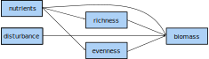

<style>
body {
text-align: justify}
</style>


```{r setup, include=FALSE}
knitr::opts_chunk$set(echo = TRUE)
library("here")
```


# Dataset
The data for following exercises stem from the publication [*Grassland ecosystem recovery after soil disturbance depends on nutrient supply rate*](https://onlinelibrary.wiley.com/doi/abs/10.1111/ele.13591) (@seabloom20) and are publicly available at [Dryad](https://datadryad.org/stash/dataset/doi:10.5061/dryad.83bk3j9pc).
The data were obtained during the long-term field experiment [Cedar Creek LTER](https://www.cedarcreek.umn.edu/) and target the effects of human disturbances on grassland ecosystem functioning and biodiversity.


## Data collection
Following description of the data collection process is taken from @seabloom20.


### Treatment
The **disturbance treatment** was replicated in the three old-fields (A, B and C) in a completely randomised block design (two treatments in each of three fields for a total of 6 35 × 55 m large plots).
In 1982, in each of the fields, one of these two 35 × 55 m areas was selected to be disturbed with a disk harrow. After, the soil was hand raked to smooth the soil and remove any remaining vegetation, so that subsequent colonisation was solely from seeds or small rhizome fragments.
Within each of the 6 large plots, the 54 small plots were arrayed in 6 × 9 grid with 1 m buffers between each plot. Aluminium flashing was buried to depth of 30 cm around each plot to prevent horizontal movement of nutrients and spreading of plants through vegetative growth.


The **nutrient treatments** were replicated six times in a completely randomised design in each of the 35 × 55 m plots (54 4 × 4 m small plots) yielding `r 6 * 54` (6 x 54) plots.
The analyses focuses on two nutrient treatments:

1) Control (no nutrients; Treatment I) and
2) Other Nutrients and 9.5 g of N (Treatment F)


### Sampling and analysis
At peak biomass (mid-July to late August), all aboveground biomass was clipped in a 3 m by 10 cm strip (0.3 m^2^) in each plot. Note that there were 4 years when the disturbed plots were not sampled or only sampled in a single field.
The biomass was sorted into dead, previous year's growth (litter) and current year's growth (live biomass). Live biomass was sorted to species, dried and weighed.
We estimated **total aboveground biomass** as the summed biomass of all non-woody species in each 0.3 m^2^ sample, converted to g/m^2^.

**Species richness** is the number of species in each 0.3 m^2^ sample.
We quantified **plant diversity** as the Effective Number of Species based on the Probability of Interspecific Encounter (ENS~PIE~), a measure of diversity that is more robust to the effects of sampling scale and less sensitive to the presence of
rare species than species richness.
ENS~PIE~ is equivalent to the Inverse Simpson's index of diversity ($1 / \sum_{i=1}^{S} p_i^2$ where $S$ is the total number of species and $p_i$ is the proportion of the community biomass reesented by species $i$).


## Load data
```{r}
seabloom <- read.table(here("2_Modeling/Data_preparation/seabloom-2020-ele-dryad-data/cdr-e001-e002-output-data.csv"),
                       sep = ",", header = TRUE)
```


## Explore data
```{r}
dim(seabloom)
str(seabloom)
```

Exploring the data reveals 16 variables with each 5040 data points:

* `exp`: treatments in split-plot design: 1 = disturbance (Control or Disked, 35 × 55 m plots) and 2 = nutrient addition (9 levels, 4 × 4 m plots)
* `field`: three experimental fields A, B and C
* `plot`: 54 plots within fields
* `disk`: disking treatment (0 = intact at start of experiment, 1 = disked at start of experiment)
* `yr.plowed`: last year field was plowed for agriculture (A: 1968, B: 1957 and C: 1934)
* `ntrt`: nine levels representing different combinations of nitrogen (0 to 27.2 g N year^-1^ added as NH~4~NO~3~) and other nutrients (20 g m^−2^ year^−1^ P~2~0~5~; 20 g m^−2^ year^−1^ K~2~0; 40 g m^−2^ year^−1^ CaCO~3~; 30.0 g m^−2^ year^−1^ MgSO~4~; 18 μg m^−2^ year^−1^ CuSO~4~; 37.7 μg m^−2^ year^−1^ ZnSO~4~; 15.3 μg m^−2^ year^−1^ CoCO~2~; 322 μg m^−2^ year^−1^ MnCl~2~ and 15.1 μg m^−2^ year^−1^ NaMoO~4~; details see Table S1 in publication). Nutrients were applied twice per year in mid-May and mid-June.
- `nadd`: nitrogen additon rate (g/m^2^/yr)
- `other.add`: other nutrient treatment (0 = control, 1 = other nutrients added)
- `year`: sampling year
- `dur`: duration of experiment
- `precip.mm`: annual precipitation (mm)
- `precip.gs`: growing season precipitation (mm)
- `mass.above`: aboveground biomass (g/m^2^)
- `rich`: species richness (species/0.3 m^2^)
- `even`: Simpson's evenness
- `ens.pie`: effective number of species (= probability of interspecific encounter,	equivalent to inverse Simpson's diversity)
<!-- - `origin`: species origin (native or introduced) -->
<!-- - `duration`: species lifespan (annual, bienniel, perennial) -->
<!-- - `functional.group`: species functional group: -->
<!--   + `C3` = C3 grass -->
<!--   + `C4` = C4 grass -->
<!--   + `F` = forb -->
<!--   + `L` = legume -->
<!--   + `S` = sedge -->


### Factors as factors
As `ntrt` is a coding scheme for different nutrients added, it is crucial to treat it as such rather than as integers.

```{r}
seabloom$ntrt <- as.factor(seabloom$ntrt)
str(seabloom$ntrt)
```

<div class="alert alert-info">
  <strong>Exercise:</strong> what do you think is wrong with keeping `ntrt` as integers?
</div>


<!-- ### Aggregate -->
<!-- To cirumvent the dilemma with the count data, the data were averaged by year, nutrient  and disturbance treatment and field. -->


<!-- ```{r} -->
<!-- seabloom.agg <- aggregate(list(rich = seabloom$rich, even = seabloom$even, -->
<!--                                ens.pie = seabloom$ens.pie,  -->
<!--                                mass.above = seabloom$mass.above,  -->
<!--                                precip.mm = seabloom$precip.mm, -->
<!--                                precip.gs = seabloom$precip.gs), -->
<!--                           by = list(year = seabloom$year, nadd = seabloom$nadd, -->
<!--                                     disk = seabloom$disk,  -->
<!--                                     field = seabloom$field), -->
<!--                           FUN = mean, data = seabloom) -->
<!-- ``` -->


### Overview
The `pairs` function yields an overview over the numerical data that we will use for the following exercises.


```{r}
pairs(seabloom[, c(7, 11:16)], lower.panel = NULL)
```


# Metamodel
A [metamodel](https://en.wikipedia.org/wiki/Metamodeling) summarizes the concept behind a model and links it to theory.
Here, the metamodel is visualized as a [directed acyclic graph (DAG)](https://en.wikipedia.org/wiki/Directed_acyclic_graph) which reads as:
productivity (biomass) is directly influenced by the environment (nutrients, disturbance and precipitation) on the one hand and biodiversity (richness and evenness) on the other hand.
Also some elements of the environment influence biodiversity and thus, have an additional indirect effect on productivity via biodiversity.


{width=70%}


<!-- ## Subset to one year -->
<!-- For simplicity, set the focus on only one year. -->
<!-- Then, `r dim(seabloom[seabloom$year == 2000, ])[1]` observations remain. -->

<!-- NOT: -->
<!-- ```{r} -->
<!-- # seabloom <- seabloom[seabloom$year == 2000, ] -->
<!-- # dim(seabloom) -->
<!-- ``` -->


# Linear model
First, implement the metamodel into a [linear model (LM)](https://en.wikipedia.org/wiki/Linear_model).
For this, three models are necessary: one that accounts for the direct- and two for the indirect effects. 


## Direct effects
If a linear model is visualized in a DAG, it becomes apparent that there is a set of permitted, but unanalyzed correlations among the predictors. 
These correlations have a huge influence on the coefficients between the predictors $x_{1\ldots i}$ (here, nutrients, precipitation, richness and evenness) and the response $y$ (here, biomass).
Despite their importance, it is impossible to include any information about the reason of the correlations between the predictors.
Further, they make it nearly impossible to create a proper causal model, since there are many possible causal relations that can create a set of "unanalyzed
associations" what hinders interpretations [@grace21].


{width=45%}


<div class="alert alert-info">
  <strong>Exercise:</strong> write the linear model in the DAG above in R syntax.
</div>


```{r class.source = 'fold-hide'}
# lm.dir <- lm(mass.above ~ nadd + precip.mm + rich + even,
#              data = seabloom)
# summary(lm.dir)
```


## Indirect effects
To account for the indirect effects, two additional LMs are necessary: one with richness and one with evenness as response.

{width=37%}


```{r}
lm.rich <- lm(rich ~ nadd + precip.mm, data = seabloom)
summary(lm.rich)

lm.even <- lm(even ~ nadd + precip.mm, data = seabloom)
summary(lm.even)
```


## Conclusion
**UPDATE: The direct effect model showed that in the year 2000 biomass was statistically significantly positively related to nutrient input (the nitrogen additon rate `nadd`) and species richness (`rich`), but not to evenness (`even`).
Additionally, nutrient input had a statistically significantly negative influence on species richness and to a lesser extent, also on evenness.**


# Structural equation modeling
Structural equations aspire to represent cause-effect relationships and thus, they can be used to represent scientific, causal hypotheses. A key feature of structural equation models is the ability to investigate the networks of connections among system components [@grace12].


To evaluate the SEMs, we will use the package [`lavaan`](https://lavaan.ugent.be/) that relies on the computation of covariance matrices to fit the structural equations (this approach is known as 'global estimation').
It comes with full support for categorical data (any mixture of binary, ordinal and continuous observed variables), can handle both latent and composite variables, performs mediation analysis and calculates the magnitude of indirect effects [@rosseel12; @rosseel21].


```{r}
library("lavaan")
```


## Collinearity
Variables that are highly correlated with $r > 0.85$ become redundant. Then, one of them can be dropped or they can be modeled summarized as a latent variable [@grace06].

Inspecting our set of variables shows that correlations between all variables are rather weak except the precipitation throughout the year and those throughout the field season.


```{r}
round(cor(seabloom[, c(7, 11:16)]), digits = 2)
```


## An example SEM
This toy model shall illustrate the logic of SEM.
It contains the same variables and aims at evaluating the same metamodel as the LM before to ease comparability between the two methods.
A huge benefit of SEM is that variables can appear as both predictors and responses what allows the evaluation of direct and indirect effects in one go (as shown in the [directed acyclic graph (DAG)](https://en.wikipedia.org/wiki/Directed_acyclic_graph) below).
In SEM jargon, predictors (nodes that have no arrows pointing at them) are called exogenous-, while responses (nodes that have arrows pointing at them) endogeneous variables.


{width=70%}


The table below summarizes the operators of `lavaan` syntax. 
For example, an arrow in a DAG is represented by a tilde.


| Formula type | Operator | Meaning | Example |
| :----- | :----- | :----- | :----- |
| regression  | `~` | is regressed on | `y ~ x` |
| correlation | `~~` | correlate errors for | `y1 ~~ y2` |
| latent variable | `=~` | set reflective indicators | `Height =~ y1 + y2 + y3` |
| composite variable | `<~` | set formative indicators | `Comp1 <~ 1*x1 + x2 + x3` |
| mean/intercept | `~ 1` | estimate mean for `y` without `x`s | `y ~ 1` |
| label parameter | `*` | name coefficients | `y ~ b1*x1 + b2*x2` |
| define quantity | `:=` | define quantity | `TotalEffect := b1*b3 + b2` |
| define thresholds | `|` | for ordered categorial variable | `u | t1 + t2` |


<div class="alert alert-info">
  <strong>Exercise:</strong> translate the model in the DAG above into `lavaan` syntax with the help of this table.
</div>


```{r class.source = 'fold-hide'}
simple <-
"mass.above ~ nadd + rich + even + precip.mm + disk
rich ~ nadd + precip.mm
even ~ nadd + precip.mm"
```


## Normal distribution
`lavaan` uses a [$\chi^2$ test](https://en.wikipedia.org/wiki/Chi-squared_test) to compare the estimated- to the observed covariance matrix to compute the goodness of fit for the SE model under the assumption that all observations are independent and all variables follow a (multivariate) normal distribution [@grace06].
Note, that these distributional assumptions only apply to endogenous variables, whereas the distribution of exogenous variables has no bearing on assumptions [@grace21].


We use a graphical method to assess the fit of the endogeneous variables to a normal distribution, the [quantile-quantile plots (Q-Q plots)](https://en.wikipedia.org/wiki/Q%E2%80%93Q_plot). Hereby, the quantiles of the data are compared to those of a theoretical distribution (i.e., the normal distribution).
If the data would be normally distributed, the points would match one to one and thus, align diagonally. In the Q-Q plot, this match is indicated by the black line.

The package [`MVN`](https://cran.r-project.org/web/packages/MVN/index.html) allows to plot several Q-Q plots at once and also offers several tests to [multivariate normal distribution (MVN)](https://en.wikipedia.org/wiki/Multivariate_normal_distribution). Here, we employ the Henze-Zirkler's test that has been recommended as a formal test of MVN [@mecklin05].


```{r}
library("MVN")

mvn(data = seabloom[, c(14:16)], mvnTest = "hz", univariatePlot = "qqplot")
```


Alternatively, also histograms overlaid with a normal distribution of the same mean and standard deviation as the data allows to gain insight into the distribution.
First, let's define a function that plots the histogram and the expected density curve (it expects a numerical vector and a character string as input):

```{r}
histWithDensity <- function(variable, name){
  hist(variable, prob = TRUE, main = "", xlab = name)
  x <- seq(min(variable), max(variable), length = 400)
  y <- dnorm(x, mean = mean(variable), sd = sd(variable))
  lines(x, y, col = "red", lwd = 2)
  }
```


Then, we can apply this function to our three endogenous variables to plot the histograms with the expected density curves under a normal distribution:
```{r}
par(mfrow = c(1, 3))
histWithDensity(seabloom$mass.above, "mass.above")
histWithDensity(seabloom$rich, "rich")
histWithDensity(seabloom$even, "even")
```


<div class="alert alert-info">
  <strong>Exercise:</strong> would you infer that the endogenous variables meet the assumption of being (multivariate) normally distributed from the results of the the Q-Q plots, the Henze-Zirkler test and the histograms? And why (not)?
</div>


## Data transformation
Transformation of the three endogenous variables shall make them more "normal".
<!-- However, this works only for continuous variables. -->
<!-- Count data (in our example `rich`) are discrete data and thus, only have non-zero probabilities on the natural numbers. -->


```{r}
seabloom$log.mass.above <- sqrt(seabloom$mass.above)
seabloom$log.even <- sqrt(seabloom$even)
seabloom$log.rich <- sqrt(seabloom$rich)

mvn(data = seabloom[, c(17:19)], mvnTest = "hz", univariatePlot = "qqplot")

par(mfrow = c(1, 3))
histWithDensity(seabloom$log.mass.above, "log(mass.above)")
histWithDensity(seabloom$log.rich, "log(rich)")
histWithDensity(seabloom$log.even, "log(even)")
```


<!-- ### Power transform -->
<!-- Only variable that turns into ND is even with the power transformation -->
<!-- ```{r} -->
<!-- library(MASS) -->
<!-- ## Richness -->
<!-- Box <- boxcox(seabloom$rich ~ 1, lambda = seq(-6, 6, 0.1)) -->
<!-- Cox <- data.frame(Box$x, Box$y) -->
<!-- Cox2 <- Cox[with(Cox, order(-Cox$Box.y)), ] -->
<!-- Cox2[1, ] -->
<!-- lambda <- Cox2[1, "Box.x"] -->
<!-- seabloom$bc.rich <- (seabloom$rich ^ lambda - 1) / lambda -->

<!-- histWithDensity(seabloom$rich) -->
<!-- histWithDensity(seabloom$bc.rich) -->

<!-- ## Evennness -->
<!-- Box <- boxcox(seabloom$even ~ 1, lambda = seq(-6, 6, 0.1)) -->
<!-- Cox <- data.frame(Box$x, Box$y) -->
<!-- Cox2 <- Cox[with(Cox, order(-Cox$Box.y)), ] -->
<!-- Cox2[1, ] -->
<!-- lambda <- Cox2[1, "Box.x"] -->
<!-- seabloom$bc.even <- (seabloom$even ^ lambda - 1) / lambda -->

<!-- histWithDensity(seabloom$even) -->
<!-- histWithDensity(seabloom$bc.even) -->

<!-- ## Biomass -->
<!-- Box <- boxcox(seabloom$mass.above ~ 1, lambda = seq(-6, 6, 0.1)) -->
<!-- Cox <- data.frame(Box$x, Box$y) -->
<!-- Cox2 <- Cox[with(Cox, order(-Cox$Box.y)), ] -->
<!-- Cox2[1, ] -->
<!-- lambda <- Cox2[1, "Box.x"] -->
<!-- seabloom$bc.mass.above <- (seabloom$mass.above ^ lambda - 1) / lambda -->

<!-- histWithDensity(seabloom$mass.above) -->
<!-- histWithDensity(seabloom$bc.mass.above) -->

<!-- mvn(data = seabloom[, c(5:6, 8, 14:16)], mvnTest = "hz", -->
<!--     univariatePlot = "qqplot") -->
<!-- ``` -->


## Fit the model
Now, let's fit the model with `lavaan`'s `sem` function.
As the data clearly deviates from a MVN, we use the `MLM` estimator that provides standard errors and a $\chi^2$ test statistic robust to non-normality.
Hereby, the Satorra-Bentler correction is used to correct the value of the ML-based $\chi^2$ test statistic by an amount that reflects the degree of [kurtosis](https://en.wikipedia.org/wiki/Kurtosis) [@rosseel12].^[More background on robust corrections to standard errors and test statistics in SEM can be found in @savalei14.]


```{r}
fit.simple <- sem(simple, data = seabloom, estimator = "MLM")
```


Oups, the algorithm converges with a warning. Kindly, it informs us how to fix this.


<div class="alert alert-info">
  <strong>Exercise:</strong> let's obey the software and execute the code from the hint.
</div>

```{r class.source = 'fold-hide'}
# varTable(fit.simple)
```

This reveals an enormous difference in magnitude between the variance of biomass (`mass.above`) and the other variables.


## Rescale variables
To remove this difference in magnitude between the variables, we divide `mass.above` and `precip.mm` by 100 what changes the unit from g/m^2^ to 10 mg/m^2^ and from mm to 0.1 m respectively.
The boxplots show that the range of the variables is now more similar.


```{r}
seabloom$mass.above <- seabloom$mass.above / 100
seabloom$precip.mm <- seabloom$precip.mm / 100

boxplot(seabloom[, c(7, 11, 13:16)], las = 2)
```

Then, run `sem` again with the rescaled `biomass` and `precip.mm` variables:

```{r}
fit.simple <- sem(simple, data = seabloom, estimator = "MLM")
summary(fit.simple, fit.measures = TRUE)
```


## Goodness of fit
This time, the model converged, however, with poor fit:

- The ratio of the test statistic and the degrees of freedom should be smaller than 2. Here, the ratio is `r round(fitmeasures(fit.simple, "chisq"), digits = 2)` / `r fitmeasures(fit.simple, "df")` = `r round(fitmeasures(fit.simple, "chisq") / fitmeasures(fit.simple, "df"), digits = 2)`, what indicates that the model is quite far away from a decent fit [@grace21].
- The $p$-value, which represents the probability of the data given our model (or no significant discrepancy between model and data), should be larger than 0.05 [@grace21].
- The [comparative fit index (CFI)](https://en.wikipedia.org/wiki/Confirmatory_factor_analysis#Comparative_fit_index) ranges between zero and one, whereas a value $> .95$ is considered as a good fit indicator [@hu99].
Our robust CFI of `r round(fitmeasures(fit.simple, "cfi.robust"), digits = 2)` is fairly below this threshold. In compoarison to the $p$-value, the CFI has the advantage to be independent of sample size.


## Modification indices
To improve the model fit, we look for missing paths via the modification indices. They indicate an estimated drop in the model $\chi^2$ resulting from freeing fixed parameters via including a missing path.
3.84 is considered as the critical threshold, the "single-degree-of-freedom $\chi^2$ criterion" [@grace21]. 


```{r}
modindices(fit.simple, minimum.value = 3.84)
```

In the column `mi` (for modification index) we look for high values.
Note, however, that the modification indices are uninformed suggestions and further adaptations of the model based on their information needs to be based on theory.

In this example, the modification indices indicate--amongst other--a missing relation between richness and evenness.
Including this relation into the model would expectedly improve its fit by a change in the $\chi^2$ by `r round(modindices(fit.simple, minimum.value = 3)[1, 4], digits = 3)`.


This path is necessary as richness and evenness are computationally related to each other (they are not independent quantities).
Thus, let's include a correlation between `rich` and `even` (*Note*: in SEM, a correlation between two variables points to an omitted common cause/variable that drives this correlation).
With the function `update()` it is possible to directly incorporate the missing path into the specified model without rewriting it from scratch:


```{r}
fit.simple.up <- update(fit.simple, add = "rich ~~ even")
summary(fit.simple.up, fit.measures = TRUE, rsq = TRUE)

# modindices(fit.simple.up, minimum.value = 3.84)
# fit.simple.up <- update(fit.simple.up, add = "rich ~~ even")
## Seems to fail as the call is assembled wrongly:
# getCall(fit.simple); getCall(fit.simple.up)
```

**Now, the model has a decent fit with a ratio of test statistic and degrees of freedom smaller than two (i.e. `r round(fitmeasures(fit.simple.up, "chisq") / fitmeasures(fit.simple.up, "df"), digits = 2)`) and a $p$-value of `r round(fitmeasures(fit.simple.up, "pvalue"), digits = 2)`. Further, also the robust CFI is now `r round(fitmeasures(fit.simple.up, "cfi.robust"), digits = 2)`.**

**Another look at the modification indices shows that further modifications would yield only smallest improvements to the model fit, so that we can ignore them confidently:**

```{r}
modindices(fit.simple.up, minimum.value = 0.01)
```


## Standardized coefficients
Using analysis of covariances allows for estimation of both unstandardized (raw) and standardized coefficients.
While the analysis is based on covariances for estimating unstandardized coefficients, it is based on correlations for estimating standardized coefficients.
The computational relation between correlations and covariances is:

$r_{xy} = \frac{cov_{xy}}{SD_x \times SD_y}$

... where $r_{xy}$ are the correlations, $cov_{xy}$ the covariances and $SD_x$ and $SD_y$ the respective standard deviations (the square roots of the respective variance $= \sqrt{var_x}$ and $= \sqrt{var_y}$)  [@grace21].


Significance testing of standardized coefficients violates statistical principles as significance tests are based on unstandardized (raw) coefficients
Thus, standardized coefficients are used for interpretation only [@grace21].


For raw coefficients, the predicted effects are in raw units and have a pretty straight-forward interpretation: as in our example, e.g., the predicted change in 10 mg/m^2^ above-ground biomass associated with a certain change in added nutrients.
For the standardized coefficients, however, the interpretation is more complex: they express the predicted changes in terms of standard deviation units.
Thus, they are only interpretable within a sample what hinders generalization.
Still, they ease comparison as they are in the same units across various
pathways [@grace21].


There are different standardizations available in `lavaan`, whereof `std.all` is based on the standard deviation:


```{r}
standardizedsolution(fit.simple.up, type = "std.all")
```


## Model comparison
To evaluate whether the simple or the updated model perform better, we can calculate the [Akaike information criterion](https://en.wikipedia.org/wiki/Akaike_information_criterion) (AIC) and compute a significance test based on the $\chi^2$ test statistic with the `anova` function.


```{r}
anova(fit.simple, fit.simple.up)
```

From the ANOVA table we can see the difference in AIC = `r round(anova(fit.simple, fit.simple.up)[2, 2] - anova(fit.simple, fit.simple.up)[1, 2], digits = 2)` is clearly in favor for the updated `simple.up` model (*Note*: a difference in the AIC of two is considered as informative [@burnham02]).

Further, the difference in the $\chi^2$ is `r round(anova(fit.simple, fit.simple.up)[2, 5], digits = 2)`--far beyond the threshold value of 3.84 that is necessary to detect a statistically significant difference on a confidence level of $\alpha = 0.05$.


## Saturated model
In a saturated model all possible paths are specified and as a result, there are no degrees of freedom left [@grace10].
They represent a special class of model because they allow for everything to add up, meaning we can completely recover the observed matrix of covariances. Unsaturated models have testable implications, however.
Under global estimation, our comparison for calculating the GOF is to a saturated model. The reason is that saturated models permit every covariance to be explained, so the model fit function value $F_{ML}$ fit function goes to zero. Thus, also $\chi^2 = 0$.
In comparison, an unsaturated model will have a positive $F_{ML}$ [@grace21].


Adding each a path from `disk` to richness (`rich`) and evenness (`even`) turns our simple model into a saturated one.

{width=70%}

```{r}
satur <-
"mass.above ~ nadd + rich + even + precip.mm + disk
rich ~ nadd + precip.mm + disk
even ~ nadd + precip.mm + disk

rich ~~ even"

fit.satur <- sem(satur, data = seabloom, estimator = "MLM")
summary(fit.satur, rsq = TRUE)
```


<div class="alert alert-info">
  <strong>Exercise:</strong> What modification indices do you expect from a saturated model?
</div>


```{r class.source = 'fold-hide'}
# modindices(fit.satur, minimum.value = 0)
```


## Importance of included paths
In combination with the AIC, from the saturated model it is possible to evaluate if there are any unsupported links in the model.


```{r}
library("AICcmodavg")

aictab(list(fit.simple, fit.simple.up, fit.satur),
       c("simple", "simple.up", "saturated"))
```

**??? Not sure how this shall show unsupported links...**


## Summary output
Now, let's have a closer look on the model via `summary` requesting also the standardized estimates:

```{r}
summary(fit.simple.up, fit.measures = TRUE, rsq = TRUE, standardized = TRUE)
```

<div class="alert alert-info">
  <strong>Exercise:</strong> how would you interpret the meaning of the $p$-values of the single paths?
</div>


The meaning of the summary output is [@grace21]:

* `Degrees of freedom` represents the number of paths omitted from
the model, which provide a capacity to test the architecture of the model
* `p-value`: probability of the data given our model
* `Std.err`, the standard error
* `Z-value`, the analogue to $t$-values derived from maximum likelihood estimation (ML)
* `P(>|z|)`, the $p$-values, the probability of obtaining a $z$ of the given value by chance
* `Regressions` = the path coefficients
  * `Estimates`, the raw unstandardized coefficients
* `Variances` = explained variance for endogenous variables = estimates of the error variances
  * `Estimates`, estimates of the error variances
* `R-square` is the variance explained for endogenous variables, the $1 - error$ variance in standardized terms. Paths from error variables represent influences from un-modeled factors.


The `inspect` function retrieves information from a `lavaan` object (for more options see the help):

```{r}
inspect(fit.simple.up, what = "r2")
```


## Visualize the results

The package [`lavaanPlot`](https://cran.r-project.org/web/packages/lavaanPlot) allows to simply and straight-forwardly visualize diagrams from `lavaan` objects.
Since it was removed from [CRAN](https://cran.r-project.org/) begin of 2021, it needs to be downloaded and installed from the archive.
The code below first tests, if `lavaanPlot` is missing in the local library and if so, installs it from the latest archived repository on CRAN.

Another library that handles `lavaan` objects would be [`semPlot`](https://cran.r-project.org/web/packages/semPlot/index.html). 


```{r}
suppressMessages(lavaanPlot_installed <- require(lavaanPlot))
if (!lavaanPlot_installed) {
  install.packages("https://cran.r-project.org/src/contrib/Archive/lavaanPlot/lavaanPlot_0.6.0.tar.gz",
                   repos = NULL, type = "source")
    }
```


Then, we can plot the results with significance levels displayed as asterisks.


```{r}
library("lavaanPlot")

lavaanPlot(model = fit.simple.up,
           node_options = list(shape = "box", color = "gray",
                               fontname = "Helvetica"),
           edge_options = list(color = "black"),
           coefs = TRUE, covs = FALSE, stars = "regress")
```


```{r}
library("semPlot")

# Add p-values and R^2: https://stackoverflow.com/questions/60706206/how-do-i-include-p-value-and-r-square-for-the-estimates-in-sempaths
# thePlot <- semPlotModel(fit.simple.up)

semPaths(fit.simple.up, what = "est", whatLabels = "est",
         residuals = FALSE, intercepts = FALSE,
         sizeMan = 10, sizeMan2 = 7, edge.label.cex = 1,
         fade = FALSE, layout = "tree", style = "mx", nCharNodes = 0,
         posCol = "#009e73ff", negCol = "#d55e00ff", edge.label.color = "black",
         layoutSplit = TRUE, curve = 1, curvature = 1, #fixedStyle = 1,
         exoCov = FALSE, rotation = 1)
```


What is missing in this plot are the $R^2$ values for the endogenous variables.
They can either be represented as the $R^2$, the variance explained for endogenous variables or as the quantity of error variances ($\zeta$) either in raw or standardized units.
Another option, if we wish to treat error variables like true causal influences,
then we might use path coefficients for their effects. These are the square
roots of the error variances (e.g., $\sqrt{0.84} = 0.92$) or alternatively, $\sqrt{1 - R^2}$ [@grace21].


## Results to report
To present the results of a SEM, following should be stated in the report [@grace21]:

* Absolute GOF statistics for final model: $\chi²$ with the affiliated $p$-value, CFI and degrees of freedom (df)
* Table of raw coefficients and statistics
* Table of total and indirect effects of interest
* Computed queries as table or graph


# LM vs SEM
The common conclusions for both LM and SEM is that in our example, evenness is of little importance for explaining the total biomass production.


Comparing SEM with LM:

* SEM represents a network type approach with direct and indirect effects
* SEM allows for sequential learning
* LM more likely to detect interactions between variables


# References

