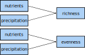

```{r setup, include=FALSE}
knitr::opts_chunk$set(echo = TRUE)
```


# Dataset
The data for following exercises stem from the publication [*Grassland ecosystem recovery after soil disturbance depends on nutrient supply rate*](https://onlinelibrary.wiley.com/doi/abs/10.1111/ele.13591) and are publicly available at [Dryad](https://datadryad.org/stash/dataset/doi:10.5061/dryad.83bk3j9pc).
The data were obtained during the long-term field experiment [Cedar Creek LTER](https://www.cedarcreek.umn.edu/) and target the effects of human disturbances on grassland ecosystem functioning and biodiversity.


## Load data
```{r}
rm(list = ls())
seabloom <- read.table("/home/r/Swiss_SEM/2_Modeling/Data_preparation/CedarCreek_Seabloom/seabloom-2020-ele-dryad-data/cdr-e001-e002-output-data.csv",
                       sep = ",", header = TRUE)
```


## Explore data
```{r}
dim(seabloom)
str(seabloom)
```

Exploring the data reveals 16 variables with each 5040 data points:

* `exp`: treatments in split-plot design: 1 = disturbance (Control or Disked, 35 × 55 m plots) and 2 = nutrient addition (9 levels, 4 × 4 m plots)
* `field`: three experimental fields A, B and C
* `plot`: 54 plots within fields
* `disk`: disking treatment (0 = intact at start of experiment, 1 = disked at start of experiment)
* `yr.plowed`: last year field was plowed for agriculture (A: 1968, B: 1957 and C: 1934)
* `ntrt`: nine levels representing different combinations of nitrogen (0 to 27.2 g N year^-1^ added as NH~4~NO~3~) and other nutrients (20 g m^−2^ year^−1^ P~2~0~5~; 20 g m^−2^ year^−1^ K~2~0; 40 g m^−2^ year^−1^ CaCO~3~; 30.0 g m^−2^ year^−1^ MgSO~4~; 18 μg m^−2^ year^−1^ CuSO~4~; 37.7 μg m^−2^ year^−1^ ZnSO~4~; 15.3 μg m^−2^ year^−1^ CoCO~2~; 322 μg m^−2^ year^−1^ MnCl~2~ and 15.1 μg m^−2^ year^−1^ NaMoO~4~; details see Table S1 in publication). Nutrients were applied twice per year in mid-May and mid-June.
- `nadd`: nitrogen additon rate (g/m^2^/yr)
- `other.add`: other nutrient treatment (0 = control, 1 = other nutrients added)
- `year`: sampling year
- `dur`: duration of experiment
* `precip.mm`: annual precipitation (mm)
* `precip.gs`: growing season precipitation (mm)
- `mass.above`: aboveground biomass (g/m^2^)
- `rich`: species richness (species/0.3 m^2^)
- `even`: Simpson's evenness
- `ens.pie`: effective number of species, (= probability of interspecific encounter	decimal	equivalent to inverse Simpson's diversity)
- `origin`: species origin (native or introduced)
- `duration`: species lifespan (annual, bienniel, perennial)
- `functional.group`: species functional group:
  + `C3` = C3 grass
  + `C4` = C4 grass
  + `F` = forb
  + `L` = legume
  + `S` = sedge


### Overview
The `pairs` function yields an overview over the numerical data. Beforehand, define a function to manipulate point size in the plot.

```{r}
panel.points <- function(x, y) {
  points(x, y, cex = 0.1)
  }

pairs(seabloom[, -c(1:3, 9)], lower.panel = NULL, upper.panel = panel.points)
```


## Materials and methods
### Disturbance treatment
The **disturbance treatment** was replicated in the three old-fields (A, B and C) in a completely randomised block design (two treatments in each of three fields for a total of 6 35 × 55 m large plots).
In April 1982, in each of the fields, one of these two 35 × 55 m areas was selected to be disturbed with a 45 cm diameter disk harrow pulled by a tractor 20 times in one direction, 20 times perpendicularly and 5 times diagonally to the first passes. Following the disking, the soil was hand raked to smooth the soil and remove any remaining vegetation, so that subsequent colonisation was solely from seeds or small rhizome fragments.
Within each of the 6 large plots, the 54 small plots were arrayed in 6 × 9 grid with 1 m buffers between each plot. Aluminium flashing was buried to depth of 30 cm around each plot to prevent horizontal movement of nutrients and spreading of plants through vegetative growth.


### Nutrient treatments
The **nutrient treatments** were replicated six times in a completely randomised design in each of the 35 × 55 m plots (54 4 × 4 m small plots) yielding `r 6 * 54` (6 x 54) plots.
The analyses focuses on two nutrient treatments:

1) Control (no nutrients; Treatment I) and
2) Other Nutrients and 9.5 g of N (Treatment F)


### Sampling and analysis
At peak biomass (mid-July to late August), all aboveground biomass was clipped in a 3 m by 10 cm strip (0.3 m^2^) in each plot. Note that there were 4 years when the disturbed plots were not sampled or only sampled in a single field. The biomass was sorted into dead, previous year’s growth (litter) and live, current year’s growth (live biomass). Live biomass was sorted to species, dried to constant mass at 40°C, and weighed to the nearest 0.01 g.
We estimated total aboveground biomass as the summed biomass of all non-woody species in each 0.3 m^2^ sample, converted to g m^-2^. We excluded woody biomass, because our goal was to estimate annual productivity and most of the woody biomass is from previous year’s growth. Woody plant biomass composed less than 1% of total biomass across the data set.

**Shorten this:** Species richness is the number of species in each 0.3 m^2^ sample.
We quantified plant diversity as the Effective Number of Species based on the Probability of Interspecific Encounter (ENS~PIE~), a measure of diversity that is more robust to the effects of sampling scale and less sensitive to the presence of
rare species than species richness (Jost, 2006, 2007; Chase and Knight, 2013).
ENS~PIE~ is equivalent to the Inverse Simpson’s index of diversity which is calculated as $1 / \sum_{i=1}^{S} p_i^2$  where S is the total number of species (i.e. species richness) and p~i~ is the proportion of the community biomass reesented by species i (Jost, 2006, 2007; Chase and Knight, 2013).
Simpson’s evenness (E) satisfies the main requirements of an evenness index (Smith and Wilson, 1996). In addition, it is directly related to ENS~PIE~ through the relationship E = ENS~PIE~/S (Smith and Wilson, 1996), thus we can factor diversity directly into its richness and evenness components through the relationship ENS~PIE~ = S*E.

<!-- Across all data, ENS~PIE~ was positively correlated with richness (r = 0.63) but uncorrelated with evenness (r = 0.03). Richness and evenness were negatively correlated (r = -0.60). -->


# Modeling
## Metamodel
The [metamodel](https://en.wikipedia.org/wiki/Metamodeling) summarizes the concept behind the model.
Here, the metamodel is visualized as a [directed acyclic graph (DAG)](https://en.wikipedia.org/wiki/Directed_acyclic_graph) which reads as:
biomass is directly influenced by the environmental parameters nutrients, disturbance and precipitation on the one hand and richness and evenness on the other hand.
The three environmental parameters also influence richness and evenness and thus, also have an indirect effect on biomass via richness and evenness.
**Describe this interaction thingy!**

{width=70%}


## Subset to one year
For simplicity, set the focus on only one year.

```{r}
seabloom <- seabloom[seabloom$year == 2000, ]
dim(seabloom)
```


## Linear models
First, implement the metamodel into a [linear model (LM)](https://en.wikipedia.org/wiki/Linear_model).
For this, three models are necessary: one that accounts for the direct- and two for the indirect effects. 

- residuals
- variance/covariance matrix


### Direct effects
{width=45%}

```{r}
lm.dir <- lm(mass.above ~ nadd + precip.mm + rich + even,
             data = seabloom)
summary(lm.dir)
```


Problem: the estimates for `precip.mm` are all `NA`s.
Reason is the focus on a single year (i.e. the year 2000) what fixes the value for `precipitation.mm` to 599.7 mm (i.e. the precipitation in 2000) and as it is impossible to predict anything from a single value, `NA` is returned.

```{r}
summary(seabloom$precip.mm)
```


Thus, `precipitation.mm` is excluded from the model from now on.

```{r}
lm.dir <- lm(mass.above ~ nadd + rich + even, data = seabloom)
summary(lm.dir)
```


### Indirect effects
To account for the indirect effects, two separate LMs are necessary: one with richness and one with evenness as response.

{width=45%}


```{r}
lm.rich <- lm(rich ~ nadd, data = seabloom)
summary(lm.rich)

lm.even <- lm(even ~ nadd, data = seabloom)
summary(lm.even)
```

### Conclusion
The direct effect model showed that in the year 2000 biomass was statistically significantly positively related to the nitrogen additon rate (`nadd`) and species richness (`rich`).
Additionally, nitrogen addition rate had a statistically significantly negative influence on species richness and to a lesser extent, also on evenness.


## Structural equation modeling
To evaluate the SEMs, load the package [`lavaan`](https://lavaan.ugent.be/).
This is a powerful piece of software that relies on **covariance matrices rather than ... as ...**

```{r}
library("lavaan")
```


- visualisation as DAG
- explain model output
- assessment of fit


### A simple SEM
<!-- This simple model shall illustrate the logic of SEM. Comparability is eased as it contains the same variables as the LM before. -->
With SEM, we can evaluate direct and indirect effects in one go.

{width=70%}


In the syntax of `lavaan`, an arrow in a DAG is represented by a tilde and the metamodel reads as:
```{r}
simple <-
"mass.above ~ nadd + disk + rich + even
rich ~ nadd
even ~ nadd"

fit.simple <- sem(simple, data = seabloom)
```


Oups, the algorithm converges with a warning: `some observed variances are (at least) a factor 1000 times larger than others; use varTable(fit) to investigate`.
Kindly, it informs us how to fix is. So, let's obey the software and run `varTable(fit.simple)`:

```{r}
varTable(fit.simple)
```

This reveals an enormous difference between the magnitude of biomass (`mass.above`) and the other variables.

```{r}
boxplot(seabloom[, c(4, 7, 11, 13:15)])
```


### Scale variables
To remove this difference in magnitude between the variables, we scale them by setting their mean to zero and their variance to one.
To do so for several columns in a dataframe, call `apply` on the columns of interest and specify the desired function (here, `scale`):


```{r}
seabloom[, c(4, 7, 11, 13:15)] <- apply(seabloom[, c(4, 7, 11, 13:15)], 
                                        2, scale)
boxplot(seabloom[, c(4, 7, 11, 13:15)])
```

Then, run the SEM again:

```{r}
fit.simple <- sem(simple, data = seabloom)
summary(fit.simple, rsq = TRUE)
```


This time, the model converged, however, with poor fit:

- The ratio of the test statistic and the degrees of freedom should be smaller than 2 (this ratio gives an indication how far away the model is from a decent fit)
- The $p$-value should be larger than 0.05


### Modification indices
To improve the model we look for missing paths via modification indices:

```{r}
modindices(fit.simple, minimum.value = 3)
```

In the column `mi` (modification index) we look for high values.
Note, however, that the modification indices are often meaningless and further adaptations of the model based on their information needs to be based on theory.

In this example, the modification indices indicate a missing relation between richness and evenness.
Including this relation into the model would improve its fit by **84.811 ??**.

So, let's decide to include a correlation between `rich` and `even`.
Note: in SEM, a correlation between two variables points to an omitted common cause/variable that drives the correlation.
With `update` it is possible to directly incorporate the missing path into the specified model:


```{r}
fit.simple.up <- update(fit.simple, add = "rich ~~ even")
# fit.simple.up <- update(fit.simple, add = "rich ~ mass.above")

summary(fit.simple.up, rsq = TRUE, fit.measures = TRUE)
# standardizedsolution(fit.simple.up)
# inspect(fit.simple.up, "r2")

modindices(fit.simple.up, minimum.value = 3)
```

Now, the model has a decent fit with a ratio of test statistic and degrees of freedom much smaller than two and a $p$-value close to 1.

A closer look on the result shows that 


```{r}
modindices(fit.simple.up, minimum.value = 3)
```


### Visualize the results
The library [`lavaanPlot`](https://cran.r-project.org/web/packages/lavaanPlot/vignettes/Intro_to_lavaanPlot.html) allows to simply and straight-forwardly visualize diagrams from `lavaan` objects.
Here, we select to display significance levels with the asterisks.


```{r}
library("lavaanPlot")

lavaanPlot(model = fit.simple.up,
           node_options = list(shape = "box", color = "gray",
                               fontname = "Helvetica"),
           edge_options = list(color = "black"),
           coefs = TRUE, covs = TRUE, stars = c("covs", "regress"))
```


### Complex sampling structure
Often, we encounter more complex sampling or experimental schemes, e.g. the data is nested within sites or contains groups such as sexes or lifestages.
As a result, the data violate the principle of being [*i.i.d.*](https://en.wikipedia.org/wiki/Independent_and_identically_distributed_random_variables) (independent and identically distributed).
Thus, it is necessary to account for this structure in the data in the model.


#### With piecewiseSEM
Let's encode the same model with the package [`piecewiseSEM`](https://cran.r-project.org/web/packages/piecewiseSEM/vignettes/piecewiseSEM.html) with which it is possible to include random factors into the model.
First, take a look at the model without random terms.


```{r}
library("piecewiseSEM")
library("nlme")

PsimpleList <- list(
  lm(mass.above ~ rich + even + nadd + disk, seabloom),
  lm(rich ~ nadd, seabloom),
  lm(even ~ nadd, seabloom),
  even %~~% rich)

Psimple <- as.psem(PsimpleList)
summary(Psimple, .progressBar = FALSE)
```

We see that the model fit is good (because we included the correlation between richness and evenness' errors).

The data was collected in plots within fields, which adds a block effect to our structure. We will include this block effect now as a random term.

```{r}
PsimpleRandomList <- list(
  lme(mass.above ~ rich + even + nadd + disk, random = ~ 1|field, seabloom),
  lme(rich ~ nadd, random = ~ 1|field, seabloom),
  lme(even ~ nadd, random = ~ 1|field, seabloom),
  even %~~% rich
)


PsimpleRandom <- as.psem(PsimpleRandomList)
summary(PsimpleRandom, .progressBar = FALSE)
```

Now, the effect of richness on biomass lost its statistical significance.


#### With `lavaan.survey`

Also the add-on package [`lavaan.survey`](https://cran.r-project.org/web/packages/lavaan.survey/index.html) allows the analysis of stratified, clustered or weighted data.
With this, `lavaan` objects can be processed further with the specific data structure:
first, we initialize the design and then, post-process the `lavaan` object and compute the adjusted results.


```{r}
library("lavaan.survey")

# modfit<-sem(model, data=dat, estimator = "mlm")
# survey.design <- svydesign(ids=~1, strata = ~ spatial_block, prob =~1, data=dat)
# fit_with_blocks <- lavaan.survey(modfit, survey.design)
# summary(fit_with_blocks, rsquare=T, standardized = T, fit.measures = T)


# modfit <- sem(model = fit.simple.up, data = seabloom, estimator = "mlr")
# survey.design <- svydesign(ids = ~ 1, strata = ~ field, probs = ~ 1, 
#                            data = seabloom)

# fit_with_blocks <- lavaan.survey(modfit, survey.design)
# summary(fit_with_blocks, rsquare = TRUE, standardized = TRUE,
#         fit.measures = TRUE)


design <- svydesign(ids = ~ field, nest = TRUE, data = seabloom)
fit.simple.up.nest <- lavaan.survey(lavaan.fit = fit.simple.up,
                                     survey.design = design)
summary(fit.simple.up.nest, rsq = TRUE)
```


### Saturated model
A saturated model includes all possible paths. As a result, there are no degrees of freedom left and it is impossible to estimate the model fit...

{width=70%}

```{r}
sem2 <-
"mass.above ~ nadd + rich + even + disk
rich ~ nadd + disk
even ~ nadd + disk

rich ~~ even"

fit.sem2 <- sem(sem2, data = seabloom)
summary(fit.sem2, rsq = TRUE)
```


Let's have another look at the modification indices.
```{r}
modindices(fit.sem2, minimum.value = 3)
```

The modification indices show that the model is saturated and thus, no further paths can be added to improve the model fit.


#### With `piecewiseSEM` 
Let's go again to with the package `piecewiseSEM` structure and compare its result to those of `lavaan`.


```{r}
PsaturList <- list(
  lme(mass.above ~ rich + even + nadd + disk, random = ~ 1|field, seabloom),
  lme(rich ~ nadd + disk, random = ~ 1|field, seabloom),
  lme(even ~ nadd + disk, random = ~ 1|field, seabloom),
  even %~~% rich
)

Psatur <- as.psem(PsaturList)
summary(Psatur, .progressBar = FALSE)
```


### Model pruning
Now, let's delete all non-significant paths from the model to obtain the most parsimonous model.

```{r}
sem.prune <-
"mass.above ~ nadd + rich
rich ~ nadd
even ~ nadd 

rich ~~ even"

fit.sem.prune <- sem(sem.prune, data = seabloom)
summary(fit.sem.prune)
```


### Model comparison
- add an additional variable or path, then compare the two SEMs


