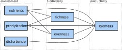
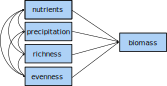

<style>
body {
text-align: justify}
</style>


```{r setup, include=FALSE}
knitr::opts_chunk$set(echo = TRUE)
library("here")
```


# To do

* References as a global summary in the end
* Present only variables that are actually used in the SEM
* If there is time at the end: add some manually calculated (very simple) examples and a bit of theory behind graphs, tracing rules and such
* Look for possible exercises


# Dataset
The data for following exercises stem from the publication [*Grassland ecosystem recovery after soil disturbance depends on nutrient supply rate*](https://onlinelibrary.wiley.com/doi/abs/10.1111/ele.13591) and are publicly available at [Dryad](https://datadryad.org/stash/dataset/doi:10.5061/dryad.83bk3j9pc).
The data were obtained during the long-term field experiment [Cedar Creek LTER](https://www.cedarcreek.umn.edu/) and target the effects of human disturbances on grassland ecosystem functioning and biodiversity.


## Load data
```{r}
seabloom <- read.table(here("2_Modeling/Data_preparation/seabloom-2020-ele-dryad-data/cdr-e001-e002-output-data.csv"),
                       sep = ",", header = TRUE)
# seabloom <- read.table("~/github/Swiss_SEM/2_Modeling/Data_preparation/seabloom-2020-ele-dryad-data/cdr-e001-e002-output-data.csv",
#                        sep = ",", header = TRUE)
```


## Explore data
```{r}
dim(seabloom)
str(seabloom)
```

Exploring the data reveals 16 variables with each 5040 data points:

* `exp`: treatments in split-plot design: 1 = disturbance (Control or Disked, 35 × 55 m plots) and 2 = nutrient addition (9 levels, 4 × 4 m plots)
* `field`: three experimental fields A, B and C
* `plot`: 54 plots within fields
* `disk`: disking treatment (0 = intact at start of experiment, 1 = disked at start of experiment)
* `yr.plowed`: last year field was plowed for agriculture (A: 1968, B: 1957 and C: 1934)
* `ntrt`: nine levels representing different combinations of nitrogen (0 to 27.2 g N year^-1^ added as NH~4~NO~3~) and other nutrients (20 g m^−2^ year^−1^ P~2~0~5~; 20 g m^−2^ year^−1^ K~2~0; 40 g m^−2^ year^−1^ CaCO~3~; 30.0 g m^−2^ year^−1^ MgSO~4~; 18 μg m^−2^ year^−1^ CuSO~4~; 37.7 μg m^−2^ year^−1^ ZnSO~4~; 15.3 μg m^−2^ year^−1^ CoCO~2~; 322 μg m^−2^ year^−1^ MnCl~2~ and 15.1 μg m^−2^ year^−1^ NaMoO~4~; details see Table S1 in publication). Nutrients were applied twice per year in mid-May and mid-June.
- `nadd`: nitrogen additon rate (g/m^2^/yr)
- `other.add`: other nutrient treatment (0 = control, 1 = other nutrients added)
- `year`: sampling year
- `dur`: duration of experiment
- `precip.mm`: annual precipitation (mm)
- `precip.gs`: growing season precipitation (mm)
- `mass.above`: aboveground biomass (g/m^2^)
- `rich`: species richness (species/0.3 m^2^)
- `even`: Simpson's evenness
- `ens.pie`: effective number of species, (= probability of interspecific encounter	decimal	equivalent to inverse Simpson's diversity)
- `origin`: species origin (native or introduced)
- `duration`: species lifespan (annual, bienniel, perennial)
- `functional.group`: species functional group:
  + `C3` = C3 grass
  + `C4` = C4 grass
  + `F` = forb
  + `L` = legume
  + `S` = sedge


### Overview
The `pairs` function yields an overview over the numerical data.


```{r}
pairs(seabloom[, -c(1:3, 5:6, 8:10, 12, 16)],
      lower.panel = NULL)
```


## Materials and methods
### Disturbance treatment
The **disturbance treatment** was replicated in the three old-fields (A, B and C) in a completely randomised block design (two treatments in each of three fields for a total of 6 35 × 55 m large plots).
In April 1982, in each of the fields, one of these two 35 × 55 m areas was selected to be disturbed with a 45 cm diameter disk harrow pulled by a tractor 20 times in one direction, 20 times perpendicularly and 5 times diagonally to the first passes. Following the disking, the soil was hand raked to smooth the soil and remove any remaining vegetation, so that subsequent colonisation was solely from seeds or small rhizome fragments.
Within each of the 6 large plots, the 54 small plots were arrayed in 6 × 9 grid with 1 m buffers between each plot. Aluminium flashing was buried to depth of 30 cm around each plot to prevent horizontal movement of nutrients and spreading of plants through vegetative growth.


### Nutrient treatments
The **nutrient treatments** were replicated six times in a completely randomised design in each of the 35 × 55 m plots (54 4 × 4 m small plots) yielding `r 6 * 54` (6 x 54) plots.
The analyses focuses on two nutrient treatments:

1) Control (no nutrients; Treatment I) and
2) Other Nutrients and 9.5 g of N (Treatment F)


### Sampling and analysis
At peak biomass (mid-July to late August), all aboveground biomass was clipped in a 3 m by 10 cm strip (0.3 m^2^) in each plot. Note that there were 4 years when the disturbed plots were not sampled or only sampled in a single field. The biomass was sorted into dead, previous year’s growth (litter) and live, current year’s growth (live biomass). Live biomass was sorted to species, dried to constant mass at 40°C, and weighed to the nearest 0.01 g.
We estimated total aboveground biomass as the summed biomass of all non-woody species in each 0.3 m^2^ sample, converted to g m^-2^. We excluded woody biomass, because our goal was to estimate annual productivity and most of the woody biomass is from previous year’s growth. Woody plant biomass composed less than 1% of total biomass across the data set.

**Shorten this:** Species richness is the number of species in each 0.3 m^2^ sample.
We quantified plant diversity as the Effective Number of Species based on the Probability of Interspecific Encounter (ENS~PIE~), a measure of diversity that is more robust to the effects of sampling scale and less sensitive to the presence of
rare species than species richness (Jost, 2006, 2007; Chase and Knight, 2013).
ENS~PIE~ is equivalent to the Inverse Simpson’s index of diversity which is calculated as $1 / \sum_{i=1}^{S} p_i^2$  where S is the total number of species (i.e. species richness) and p~i~ is the proportion of the community biomass reesented by species i (Jost, 2006, 2007; Chase and Knight, 2013).
Simpson’s evenness (E) satisfies the main requirements of an evenness index (Smith and Wilson, 1996). In addition, it is directly related to ENS~PIE~ through the relationship E = ENS~PIE~/S (Smith and Wilson, 1996), thus we can factor diversity directly into its richness and evenness components through the relationship ENS~PIE~ = S*E.

<!-- Across all data, ENS~PIE~ was positively correlated with richness (r = 0.63) but uncorrelated with evenness (r = 0.03). Richness and evenness were negatively correlated (r = -0.60). -->


# Metamodel
A [metamodel](https://en.wikipedia.org/wiki/Metamodeling) summarizes the concept behind a model and links it to theory.
Here, the metamodel is visualized as a [directed acyclic graph (DAG)](https://en.wikipedia.org/wiki/Directed_acyclic_graph) which reads as:
productivity (biomass) is directly influenced by the environment (nutrients, disturbance and precipitation) on the one hand and biodiversity (richness and evenness) on the other hand.
The environment influences also biodiversity and thus, also has an indirect effect on productivity via biodiversity.
**Describe this interaction thingy!**

{width=70%}


## Subset to one year
For simplicity, set the focus on only one year.
Then, `r dim(seabloom[seabloom$year == 2000, ])[1]` observations remain.

```{r}
seabloom <- seabloom[seabloom$year == 2000, ]
dim(seabloom)
```


# Linear models
First, implement the metamodel into a [linear model (LM)](https://en.wikipedia.org/wiki/Linear_model).
For this, three models are necessary: one that accounts for the direct- and two for the indirect effects. 

- residuals
- variance/covariance matrix


## Direct effects
{width=45%}

```{r}
lm.dir <- lm(mass.above ~ nadd + precip.mm + rich + even,
             data = seabloom)
summary(lm.dir)
```


Problem: the estimates for `precip.mm` are all `NA`s.
Reason is the focus on a single year (i.e. the year 2000) what fixes the value for `precipitation.mm` to 599.7 mm (i.e. the precipitation in 2000) and as it is impossible to predict anything from a single value, `NA` is returned.

```{r}
summary(seabloom$precip.mm)
```


Thus, `precipitation.mm` is excluded from the model from now on.

```{r}
lm.dir <- lm(mass.above ~ nadd + rich + even, data = seabloom)
summary(lm.dir)
```


## Indirect effects
To account for the indirect effects, two separate LMs are necessary: one with richness and one with evenness as response.

{width=45%}


```{r}
lm.rich <- lm(rich ~ nadd, data = seabloom)
summary(lm.rich)

lm.even <- lm(even ~ nadd, data = seabloom)
summary(lm.even)
```


## Conclusion
The direct effect model showed that in the year 2000 biomass was statistically significantly positively related to the nitrogen additon rate (`nadd`) and species richness (`rich`).
Additionally, nitrogen addition rate had a statistically significantly negative influence on species richness and to a lesser extent, also on evenness.


# Structural equation modeling
Structural equations aspire to represent cause-effect relationships and thus, they can be used to represent scientific, causal hypotheses. **A key feature of structural equation models is the ability to investigate the networks of connections among system components** [@grace12].


To evaluate the SEMs, load the package [`lavaan`](https://lavaan.ugent.be/).
This is a powerful piece of software that relies on the computation of covariance matrices to fit the structural equations.
It comes with full support for categorical data (any mixture of binary, ordinal and continuous observed variables), can handle both latent and composite variables, performs mediation analysis and calculates the magnitude of indirect effects [@rosseel12 + website].


```{r}
library("lavaan")
```


## Collinearity
Variables that are highly correlated with $r > 0.85$ become redundant. Then, one of them can be dropped or they can be modeled summarized as a latent variable [@grace06].

Inspecting our set of variables shows that correlations between all variables are fairly low.


```{r}
round(cor(seabloom[, c(4, 7, 13:15)]), digits = 2)
```


## An example SEM
This toy model shall illustrate the logic of SEM. Comparability is eased as it contains the same variables as the LM before.
A huge benefit of SEM is that variables can appear as both predictors and responses what allows the evaluation of direct and indirect effects in one go (as shown in the [directed acyclic graph](https://en.wikipedia.org/wiki/Directed_acyclic_graph) (DAG) below).


{width=70%}


The table below summarizes the operators of `lavaan` syntax. 
For example, an arrow in a DAG is represented by a tilde.


| Formula type | Operator | Mnemonic |
| :----- | :----- | :----- |
| regression | ~ | is regressed on |
| latent variable | =~ | is measured by |
| (residual) (co)variance | ~~ | is correlated with |
| intercept | ~ 1 | intercept |


<div class="alert alert-info">
  <strong>Exercise:</strong> translate the model in the DAG above into `lavaan` syntax with the help of this table.
</div>


```{r class.source = 'fold-hide'}
simple <-
"mass.above ~ nadd + disk + rich + even
rich ~ nadd
even ~ nadd"
```

## Normal distribution
`lavaan` uses a [$\chi^2$ test](https://en.wikipedia.org/wiki/Chi-squared_test) to compare the estimated- to the observed covariance matrix to compute the goodness of fit for the SE model under the assumption that all observations are independent and all variables follow a (multivariate) normal distribution (Grace 2006).
Note, that these distributional assumptions only apply to endogenous variables, whereas the distribution of exogenous variables has no bearing on assumptions.


We use a graphical method to assess the fit of the endogeneous variables to a normal distribution, the [quantile-quantile plots (Q-Q plots)](https://en.wikipedia.org/wiki/Q%E2%80%93Q_plot). Hereby, the quantiles of the data are compared to those of a theoretical distribution (i.e., the normal distribution).
If the data would be normally distributed, the points would match one to one and thus, align diagonally. In the Q-Q plot, this match is indicated by the black line.

The package [`MVN`](https://cran.r-project.org/web/packages/MVN/index.html) allows to plot several Q-Q plots at once and also offers several tests to [multivariate normal distribution (MVN)](https://en.wikipedia.org/wiki/Multivariate_normal_distribution). Here, we employ the Henze-Zirkler's test that has been recommended as a formal test of MVN [@mecklin05].


```{r}
library("MVN")

seabloom.num <- seabloom[, -c(1:10, 11, 12, 16)]

mvn(data = seabloom.num, mvnTest = "hz", univariatePlot = "qqplot")
```


Alternatively, also histograms in comparison overlaid with a normal distribution allows to gain insight into the distribution:
```{r}
par(mfrow = c(1, 3))
hist(seabloom$mass.above, prob = TRUE, main = "")
x <- seq(min(seabloom$mass.above), max(seabloom$mass.above), length = 400)
f <- dnorm(x, mean = mean(seabloom$mass.above), sd = sd(seabloom$mass.above))
lines(x, f, col = "red", lwd = 2)


hist(seabloom$rich, prob = TRUE, main = "")
x <- seq(min(seabloom$rich), max(seabloom$rich), length = 400)
f <- dnorm(x, mean = mean(seabloom$rich), sd = sd(seabloom$rich))
lines(x, f, col = "red", lwd = 2)


hist(seabloom$even, prob = TRUE, main = "")
x <- seq(min(seabloom$even), max(seabloom$even), length = 400)
f <- dnorm(x, mean = mean(seabloom$even), sd = sd(seabloom$even))
lines(x, f, col = "red", lwd = 2)
```


<div class="alert alert-info">
  <strong>Exercise:</strong> would you infer that the endogenous variables meet the assumption of being (multivariate) normally distributed from the results of the the Q-Q plots, the Henze-Zirkler test and the histograms? And why (not)?
</div>


## Data transformation??


## Fit the model
Now, let's fit the model with `lavaan`'s `sem` function.
As the data clearly deviates from a MVN, we use the `MLM` estimator that provides standard errors and a $\chi^2$ test statistic robust to non-normality.
Hereby, the Satorra-Bentler correction is used to correct the value of the ML-based $\chi^2$ test statistic by an amount that reflects the degree of [kurtosis](https://en.wikipedia.org/wiki/Kurtosis) [@rosseel12].^[More background on robust corrections to standard errors and test statistics in SEM can be found in @savalei14.]


```{r}
fit.simple <- sem(simple, data = seabloom, estimator = "MLM")
```


Oups, the algorithm converges with a warning. Kindly, it informs us how to fix this.


<div class="alert alert-info">
  <strong>Exercise:</strong> let's obey the software and execute the code from the hint.
</div>

```{r class.source = 'fold-hide'}
varTable(fit.simple)
```

This reveals an enormous difference in magnitude between the variance of biomass (`mass.above`) and the other variables.


## Rescale variables
<!-- **Change scale of only biomass to avoid ambiguity with standardized vs unstandardized variable interpretation** -->

To remove this difference in magnitude between the variables, we divide `mass.above` by 100 what changes the unit from g/m^2^ to 10 mg/m^2^.
The boxplots show that the range of the variables is now more similar.


```{r}
seabloom$mass.above <- seabloom$mass.above / 100
boxplot(seabloom[, c(4, 7, 13:15)])
```

Then, run `sem` again with the rescaled `biomass`:

```{r}
fit.simple <- sem(simple, data = seabloom, estimator = "MLM")
summary(fit.simple, fit.measures = TRUE, rsq = TRUE)
```


## Goodness of fit
This time, the model converged, however, with poor fit:

- The ratio of the test statistic and the degrees of freedom should be smaller than 2. Here, the ratio is `r round(summary(fit.simple, fit.measures = TRUE)[[1]][3], digits = 1)` / `r summary(fit.simple, fit.measures = TRUE)[[1]][4]` = `r round(summary(fit.simple, fit.measures = TRUE)[[1]][3] / summary(fit.simple, fit.measures = TRUE)[[1]][4], digits = 1)`, what indicates that the model is quite far away from a decent fit.
- The $p$-value, which represents the probability of the data given our model (or no significant discrepancy between model and data) [JBG], should be larger than 0.05.
- The [comparative fit index](https://en.wikipedia.org/wiki/Confirmatory_factor_analysis#Comparative_fit_index) (CFI) ranges between zero and one, whereas a value $> .95$ is considered as a good fit indicator [@hu99]. Our CFI of `r round(summary(fit.simple, fit.measures = TRUE)[[1]][17], digits = 1)` is fairly below this threshold.


## Modification indices
To improve the model fit, we look for missing paths via modification indices. They indicate a drop in the model $\chi^2$ value resulting from freeing fixed parameters via including a missing path.
3.84 is considered as the critical threshold, the "single-degree-of-freedom $\chi^2$ criterion" [JBG]. 


```{r}
modindices(fit.simple, minimum.value = 3.84)
```

In the column `mi` (for modification index) we look for high values.
Note, however, that the modification indices are uninformed suggestions and further adaptations of the model based on their information needs to be based on theory.

In this example, the modification indices indicate--amongst other--a missing relation between richness and evenness.
Including this relation into the model would improve its fit by the change in $\chi^2$ by `r round(modindices(fit.simple, minimum.value = 3)[1, 4], digits = 3)`. **--> still, 104.782 - 84.811 = 19.971, but the updated model says 0.143**


This path is necessary as richness and evenness are computationally related to each other (they are not independent quantities).
Thus, let's include a correlation between `rich` and `even` (*Note*: in SEM, a correlation between two variables points to an omitted common cause/variable that drives this correlation).
With the function `update()` it is possible to directly incorporate the missing path into the specified model without rewriting it from scratch:


```{r}
fit.simple.up <- update(fit.simple, add = "rich ~~ even")
summary(fit.simple.up, rsq = TRUE, fit.measures = TRUE)
# standardizedsolution(fit.simple.up)
# inspect(fit.simple.up, "r2")

modindices(fit.simple.up, minimum.value = 3)
```

Now, the model has a decent fit with a ratio of test statistic and degrees of freedom much smaller than two (i.e. `r round(summary(fit.simple.up, fit.measures = TRUE)[[1]][3] / summary(fit.simple.up, fit.measures = TRUE)[[1]][4], digits = 2)`) and a $p$-value of `r round(summary(fit.simple.up, fit.measures = TRUE)[[1]][8], digits = 2)`.
Further, also the CFI is now `r round(summary(fit.simple.up, fit.measures = TRUE)[[1]][17], digits = 2)`.

Another look at the modification indices shows that further modifications would yield only smallest improvements to the model fit, so that we can ignore them confidently:

```{r}
modindices(fit.simple.up, minimum.value = 0)
```


## Summary output explained
* `Estimates`, the raw unstandardized coefficients
* `Std.err`, the standard error
* `Z-value`, the analog to $t$-values derived from maximum likelihood estimation (ML)
* `P(>|z|)`, the probability of obtaining a $z$ of the given value by chance
* `Regressions` ...
* `Variances` = explained variance for endogenous variables = estimates of the error variances
* `R-square` =  the $1 - error$ variance in standardized terms

[JBG]


### Standardized effects

* significance testing of standardized estimates violates statistical principles as significance tests are based on unstandardized parameters -> use for interpretation only

[JB Grace]


## Visualize the results

The library [`lavaanPlot`](https://cran.r-project.org/web/packages/lavaanPlot) allows to simply and straight-forwardly visualize diagrams from `lavaan` objects.
Since it was removed from [CRAN](https://cran.r-project.org/) begin of 2021, it needs to be downloaded and installed from the archive.
The code below first tests, if `lavaanPlot` is missing in the local library and if so, installs it from the latest archived repository on CRAN.

Another library that handles `lavaan` objects would be [`semPlot`](https://cran.r-project.org/web/packages/semPlot/index.html). 


```{r}
suppressMessages(lavaanPlot_installed <- require(lavaanPlot))
if (!lavaanPlot_installed) {
  install.packages("https://cran.r-project.org/src/contrib/Archive/lavaanPlot/lavaanPlot_0.6.0.tar.gz",
                   repos = NULL, type = "source")
    }
```


Then, we can plot the results with significance levels displayed as asterisks.


```{r}
library("lavaanPlot")

lavaanPlot(model = fit.simple.up,
           node_options = list(shape = "box", color = "gray",
                               fontname = "Helvetica"),
           edge_options = list(color = "black"),
           coefs = TRUE, covs = TRUE, stars = c("covs", "regress"))
```


## Saturated model
A saturated model includes all possible paths. As a result, there are no degrees of freedom left and it is impossible to estimate the model fit...

{width=70%}

* Saturated models have links between all the variables (more strictly true, we have no model degrees of freedom). Saturated models represent a special class of model because they allow for everything to add up, meaning we can completely recover the observed matrix of covariances when our model is saturated. Unsaturated models have testable implications, however.
* Under global estimation, our comparison is to a saturated model. The reason is that saturated models permit every covariance to be explained, so our $F_{ML}$ fit function goes to zero
* A saturated model has an $F_{ML} = 0$, and thus, $\chi^2 = 0$


[JBG]


Adding each a path from `disk` to richness (`rich`) and evenness (`even`) creates a satured model from our simple one.

```{r}
satur <-
"mass.above ~ nadd + disk + rich + even
rich ~ nadd + disk
even ~ nadd + disk

rich ~~ even"

fit.satur <- sem(satur, data = seabloom, estimator = "MLM")
summary(fit.satur, rsq = TRUE)
```


<div class="alert alert-info">
  <strong>Exercise:</strong> What modification indices do you expect from a saturated model?
</div>


```{r class.source = 'fold-hide'}
# modindices(fit.satur, minimum.value = 0)
```


## Report results
* Annotated model graph
* Absolute GOF statistics for final model: $\chi²$ + $p$-value, comparative fit index (CFI) & degrees of freedom (df)
* Table of raw coefficients and statistics
* Table of total and indirect effects of interest
* Computed queries as table or graph (ADD CALCULATION OF INDIRECT EFFECTS TO ADVANCED PART?)

[JBG material]


## Model comparison
To evaluate whether the simple or the saturated model perform better globally, we can calculate the [Akaike information criterion](https://en.wikipedia.org/wiki/Akaike_information_criterion) (AIC) for both.
A difference in the AIC of two is considered as informative [@burnham02].


```{r}
anova(fit.simple.up, fit.satur)
```

From the ANOVA table we can see the difference in AIC = `r anova(fit.simple.up, fit.satur)[1, 2] - anova(fit.simple.up, fit.satur)[2, 2]` is in the favor for the `simple` model.
That said, the AIC penalizes for model complexity by including the number of parameters of a model in the computation [@burnham02].
Consequently, the saturated model is expected to have an higher AIC because it includes two additional paths.


# References

