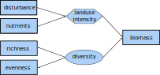
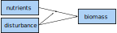
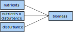

```{r setup, include=FALSE}
knitr::opts_chunk$set(echo = TRUE)
library("here")
```


# Load data and rerun the model
Here, we use the very same data set as in the introductory part to SEM (`1_basic_modeling.html`).
Also, we rescale the biomass and precipitation so that they are in approximately the same range as the other variables.


```{r}
seabloom <- read.table(here("2_Modeling/Data_preparation/seabloom-2020-ele-dryad-data/cdr-e001-e002-output-data.csv"),
                       sep = ",", header = TRUE)

seabloom$mass.above <- seabloom$mass.above / 100
seabloom$precip.mm <- seabloom$precip.mm / 100
seabloom$precip.gs <- seabloom$precip.gs / 100
```


## Rerun the model
First, we run the model as before.


{width=60%}


```{r}
library("lavaan")

simple <-
"mass.above ~ nadd + disk + rich + even + precip.mm
rich ~ nadd + precip.mm
even ~ nadd + precip.mm

rich ~~ even"

fit.simple <- sem(simple, data = seabloom, estimator = "MLM")
summary(fit.simple)
```


# Latent and composite variables

@grace08:

* Here we define a latent variable as one that represents a factor we believe to exist and to be relevant to our analysis, but which is unmeasured (Bollen 2002). Latent variables play a special role in structural equation modeling because they represent a kind of bridge between observed data and theoretical generalization.
* Composites are another type of variable that can be specified in SEMs and they represent potentially heterogeneous collections of causes. A composite can be either a composite of manifest variables or a composite of latent variables (it is also possible to have a composite that is a mixture of observed and latent variables).
* An unknown weights composite represents the collective effects of a set of causes on some response variable(s).


**Latent variables** are ... They are modeled ...
Usually, they are visualized by arrows pointing from the latent variable to the indicators.
This symbolizes the underlying process that generated the indicators. In other words, a latent variables gives rise to the indicators.
Often, ellipses are used to denote a latent variable.


**Composites** are a special case of latent variables.
In comparison to latent variables, they arise from the indicators. For this reason, they are visualized by arrows pointing from the indicators to the composite.
In that respect, they represent a collective effect (e.g., the collective effect of the abiotic environment).
Composites are often symbolized by hexangular shapes or--the same as for latent variables--by ellipses.

Carried over to our example, we measured instances of the general process diversity (richness, evenness etc.).
Further, we summarize the abiotic condition (nutrient addition, precipitation etc.) of a plot in a composite variable.


{width=50%}


## Latent variable
Let's first create a latent variable "diversity" from the three measurements of diversity (richness, evenness and ENS~PIE~).

Indicators for a LV should be positively correlated with each other.


* Latent variable models with only 2 indicators are locally non-identified. To solve this problem, we can (a) ensure x1 and x2 have equal variances, in this case by standardizing the data. (2) When latent variables are included we must specify a fixed value for some parameter associated with the LV to achieve identification. The lavaan default is to set the loading from the LV to the first-mentioned indicator to 1.0. (3) For single-indicator LVs, the default measurement error is set to 0.0 [@grace21a].


### Correlations between indicators
@grace21a:

1. we expect the indicators to be correlated with one another. If we fail to find significant correlations (based on standard tests and null hypothesis testing, p < 0.05, then the indicators are not varying in concert and the data will not support the claim of a latent cause).

```{r}
cor.test(seabloom$even, seabloom$rich)
cor.test(seabloom$ens.pie, seabloom$rich)
cor.test(seabloom$even, seabloom$ens.pie)
## Not that surprising that there is no correlation...
plot(seabloom$ens.pie, seabloom$even)
```

As evenness is negatively correlated with richness, we reverse its orientation (so that absolute evenness is found at 0, while absolute unevenness is found at 1):

```{r}
seabloom$even.rev <- 1 - seabloom$even
cor.test(seabloom$even.rev, seabloom$rich)
```


### CFA
2. It is customary in SEM practice to analyse latent variable models in two stages, first evaluating the fit between latent variables and indicators (Fig. 5A) and...

```{r}
# diversity <- 'div =~ lambda*rich + lambda*even.rev + lambda*ens.pie'
diversity <- 'div =~ a * rich + a * even.rev'
# diversity <- 'div =~ rich' # single-indicator LV

fit.diversity <- cfa(diversity, data = seabloom, estimator = "MLM")
summary(fit.diversity, fit.measures = TRUE)

# modindices(diversity)
varTable(fit.diversity)
```


Balancing the variances doesn't help...
```{r}
# varTable(fit.diversity)
# 
# seabloom$rich.var <- seabloom$rich / 10
# var(seabloom$rich.var)
# 
# diversity <- 'div =~ a * rich.var + a * even.rev'
# 
# fit.diversity <- cfa(diversity, data = seabloom, estimator = "MLM")
```


### SEM
3. ...then second, evaluating the full model (e.g. Fig. 6). SE models that include only latent variables and their indicators are often referred to as confirmatory factor analysis (CFA) models


```{r}
lv <-"
# Latent variable definition
diversity =~ rich + even

mass.above ~ nadd + disk + diversity + precip.mm
diversity ~ nadd + precip.mm"

fit.lv <- sem(lv, data = seabloom, estimator = "MLM")
summary(fit.lv)
modindices(fit.lv, minimum.value = 3.84)
```


## Composite variable
### Landuse composite
Let's create a "landuse" composite variable.
To save one parameter, we fix the `disk` at one--now the model is just identified.

```{r}
comp <- "
comp.landuse <~ 1 * disk + nadd

rich ~ precip.mm + comp.landuse
even ~ precip.mm + comp.landuse
mass.above ~ comp.landuse + rich + even + precip.mm

rich ~~ even"

fit.comp <- sem(comp, data = seabloom)
summary(fit.comp, fit.measures = TRUE)

# modindices(fit.comp, minimum.value = 3.84)
```


#### Manually compute composite
Sometimes `lavaan` struggles to fit models with composites. In such cases, the composites can be first calculated manually and then incorporated into the model as a regular variable [@grace21].

First, we specify and fit a model containing only the indicators and the response.
```{r}
compman <- 'mass.above ~ disk + nadd'
fit.compman <- sem(compman, data = seabloom)
summary(fit.compman, rsq = TRUE, standardized = TRUE)
```
Then, we compute the composite scores by taking the sum of all indicator variables multiplied by their estimates.

```{r}
seabloom$landuse <- lavInspect(fit.compman, what = "est")$beta[1, 2] * seabloom$disk +
  lavInspect(fit.compman, what = "est")$beta[1, 3] * seabloom$nadd
```

Fitting this newly calculated variable `landuse` to the response `mass.above`, yields the same standardized coefficient and R^2^ for `mass.above` as above.

```{r}
compman2 <- "mass.above ~ landuse"
fit.compman2 <- sem(compman2, data = seabloom)
summary(fit.compman2, rsq = TRUE, standardized = TRUE)
```


Finally, we can integrate the composite `landuse` into the `simple` model from before.

```{r}
comp <- "
rich ~ landuse + precip.mm
even ~ landuse + precip.mm

mass.above ~ landuse + rich + even + precip.mm

rich ~~ even"


fit.comp <- sem(comp, data = seabloom)
summary(fit.comp)
```


### Precipitation composite
```{r}
comp <- 
"comp.prec <~ 1 * precip.mm + precip.gs

rich ~ nadd + comp.prec
even ~ nadd + comp.prec
mass.above ~ nadd + disk + rich + even + comp.prec

rich ~~ even"

fit.comp <- sem(comp, data = seabloom, estimator = "MLM")
summary(fit.comp, fit.measures = TRUE)

# modindices(fit.comp, minimum.value = 3.84)
# fit.comp.up <- update(fit.comp, "rich ~ mass.above")
# summary(fit.comp.up)
```


# Interactions
{width=50%}


## Inspect the data
First, we visually inspect the hypothesized interaction between the effect of disturbance on above-ground biomass and the amount of nutrients.


```{r}
library("ggplot2")
theme_set(theme_bw())


ggplot(aes(disk, mass.above, 
           group = disk), data = seabloom) +
  geom_boxplot() +
  facet_grid( ~ nadd) +
  scale_x_continuous(breaks = c(0, 1)) +
  xlab("Disturbance") +
  ylab("Above-ground biomass [g/m²]")
```

**The higher the amount of added nutrients, the higher the gap in above-ground biomass between the undisturbed and disturbed plots.**


## Modeling the interaction
{width=50%}


```{r}
seabloom$diskxnadd <- seabloom$disk * seabloom$nadd

int <- "mass.above ~ disk + nadd + diskxnadd"
fit.int <- sem(int, data = seabloom)
summary(fit.int)
```

The results show a significant effect of both variables and their interaction.


Next, we model them as a composite:

```{r}
compint <-
"comp.int <~ 1 * disk + nadd + diskxnadd
mass.above ~ comp.int"

fit.compint <- sem(compint, data = seabloom)
summary(fit.compint, standardized = TRUE, rsq = TRUE)
```


The combined effect of the predictors is the `std.all` value for the regression (`r round(lavInspect(fit.compint, what = "std.all")$beta[2, 1], digits = 3)`).


## With the rest of the model
```{r}
int.full <-
"comp.int <~ 1 * disk + nadd + diskxnadd

mass.above ~ comp.int + rich + even + precip.mm
rich ~ nadd + precip.mm
even ~ nadd + precip.mm

rich ~~ even"

fit.int.full <- sem(int.full, data = seabloom)
summary(fit.int.full, fit.measures = TRUE, standardized = TRUE, rsq = TRUE)
```

Not the greatest fit in terms of $p$-value (`r round(fitmeasures(fit.int.full, "pvalue"), digits = 2)`), but really fine in terms of CFI (`r round(fitmeasures(fit.int.full, "cfi"), digits = 3)`).


# Complex sampling structure
Often, we encounter more complex sampling or experimental schemes, e.g. the data is nested within sites or contains groups with non-random differences such as sexes or lifestages.
As a result, these data violate the principle of being [*i.i.d.* (independent and identically distributed)](https://en.wikipedia.org/wiki/Independent_and_identically_distributed_random_variables).
Thus, it is necessary to account for this structure in the data in the model.


The add-on package [`lavaan.survey`](https://cran.r-project.org/web/packages/lavaan.survey/index.html) allows the analysis of stratified, clustered or weighted data with the help of the package [`survey`](https://r-survey.r-forge.r-project.org/survey/).
With this, `lavaan` objects can be processed further with a specific data structure:
first, we initialize the design and then, post-process the `lavaan` object and compute the adjusted results.
The result is a corrected `lavaan` object.

```{r, message=FALSE}
library("lavaan.survey")
```


As sampling was performed in `r length(unique(seabloom$plot))` plots nested in three  different fields (`A`, `B` and `C`), let's adjust for this structure.
For this, we first specify the study design as plots (`ids`) to be nested within fields (`strata`).


```{r}
design <- svydesign(ids = ~ plot, strata = ~ field, nest = TRUE, 
                    data = seabloom)
summary(design)
```


Next, we can refit the `simple` model from before with `lavaan.survey` using the specified study design as an argument.


```{r}
fit.simple.nest <- lavaan.survey(lavaan.fit = fit.simple,
                                 survey.design = design)
summary(fit.simple.nest, fit.measures = TRUE, rsq = TRUE)
```


We see that the robust $p$-value increased substantially from `r round(fitmeasures(fit.simple, "pvalue.scaled"), digits = 2)` to `r round(fitmeasures(fit.simple.nest, "pvalue.scaled"), digits = 2)`, while the R^2^, the estimates and their standard errors remained basically the same.


# Spatial autocorrelation
We can detect spatial autocorrelation in this analysis with the help of a script developped by Jarret Byrnes...


First, download the script if absent and load it.
```{r}
if(!file.exists("lavSpatialCorrect.R"))
  {system("wget https://raw.githubusercontent.com/jebyrnes/spatial_correction_lavaan/master/lavSpatialCorrect.R")}

source("lavSpatialCorrect.R")
```


## Geographical coordinates
To account for spatial autocorrelation, we first need the coordinates of the respective fields. As none are given in the publication, we use approximated location inferred from the map in the supplementary.

```{r}
seabloom$lat[seabloom$field == "A"] <- 45.4232
seabloom$lat[seabloom$field == "A"] <- -93.197

seabloom$lat[seabloom$field == "B"] <- 45.4258
seabloom$lat[seabloom$field == "B"] <- -93.2102

seabloom$lat[seabloom$field == "C"] <- 45.3969
seabloom$lat[seabloom$field == "C"] <- -93.1933
```


## Correct for spatial autocorrelation
"lavSpatialCorrect calculates Moran's I for the residuals of all endogenous variables, and then spatially corrects them via Moran's I. If they are spatially independent, the effective sample size = the true sample size.
"

```{r}
# Fails because of missing function...
# lavSpatialCorrect(fit.simple, seabloom$lon, seabloom$lat)
```


# Model pruning?
Now, let's delete all statistically non-significant paths from the model to obtain the most parsimonous model. **--> all paths are statistically significant...**


<!-- ```{r} -->
<!-- sem.prune <- -->
<!-- "mass.above ~ nadd + rich -->
<!-- rich ~ nadd -->
<!-- even ~ nadd  -->

<!-- rich ~~ even" -->

<!-- fit.sem.prune <- sem(sem.prune, data = seabloom) -->
<!-- summary(fit.sem.prune, rsq = TRUE) -->
<!-- ``` -->

