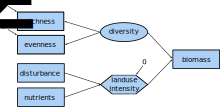

* non-linear relationships
* interactions
* multigroup fitting


```{r setup, include=FALSE}
knitr::opts_chunk$set(echo = TRUE)
```

## SEM with latent and composite variables
- difference between latent and composite variable
- SEM with latent variable(s)
- SEM with composite variable(s)

{width=70%}

# SEM with latent variable "diversity"

```{r}
sem2 <-"
# Latent variable definition
diversity =~ rich + even

mass.above ~ nadd + diversity + disk
diversity ~ nadd
"

fit.sem2 <- sem(sem2, data = seabloom)
summary(fit.sem2)
```


# SEM with composite variable "land use intensity"

<!-- ```{r} -->
<!-- compositeModel <- ' -->
<!--     #1) define the composite, scale to logN -->
<!--     Nitrogen ~ 1*logN + logNcen2 #loading on the significant path! -->
<!--   -->
<!--     #2) Specify 0 error variance -->
<!--     Nitrogen ~~ 0*Nitrogen -->
<!--  -->
<!--       #3) now, because we need to represent this as a latent variable -->
<!--       #show how species richness is an _indicator_ of nitrogen -->
<!--       Nitrogen =~ SA -->
<!--   -->
<!--     #4) BUT, make sure the variance of SA is estimated -->
<!--       SA ~~ SA -->
<!--   -->
<!--    #Regional Richness also has an effect -->
<!--     SA ~ SR -->
<!--   -->
<!--     #And account for the derivation of the square term from the linear term -->
<!--     logNcen2 ~ logN -->
<!--       ' -->
<!--   -->
<!--  # we specify std.lv=T so that the Nitrogen-SA relationship isn't fixed to 1 -->
<!--  compositeFit <- sem(compositeModel, data = seabloom, std.lv = TRUE) -->
<!--  -->
<!-- ```  -->
 

## SEM with interaction
{width=70%}


## SEM with autocorrelation (temporal, spatial) --> advanced?


