```{r setup, include=FALSE}
knitr::opts_chunk$set(echo = FALSE)
```

# Exercice

We have now analysed the model. 

How would you draw the model output to represent the minimum information required in order to reproduce this model?

<!-- Alternative wording could be "How would you draw the model output for a manuscript"? That might create more variation which would be kind of fun-->

\begin{center}
Draw your idea
\end{center}


# What can you expect to see out in nature?

{height=30%}
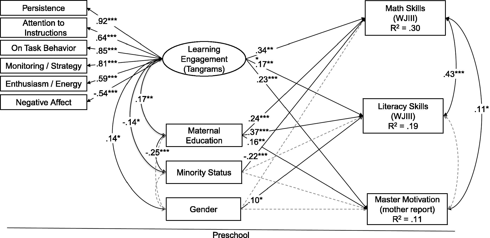{height=60%}

<!-- We chose this figure because it is a very simple illustration of a latent variable. The purpose of this study was to test whether the latent concept of "learning engagement" could be measured in a lab environment. The authors demonstrated the validity of this construct by testing whether their latent variable predicted three outcomes that learning engagement would be expected to predict controlling for three potential confounding variables -->


# What can you expect to see out in nature?
{height=30%}
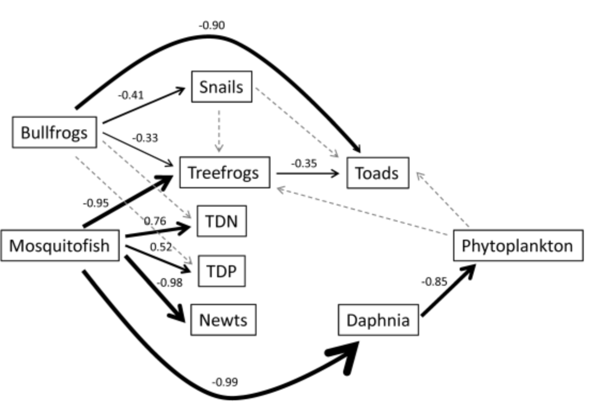{height=50%}
<!-- This figure is interesting because it's the key analysis of the paper, but the SEM diagram is only presented in the supplement. -->

# What can you expect to see out in nature?
{height=30%}
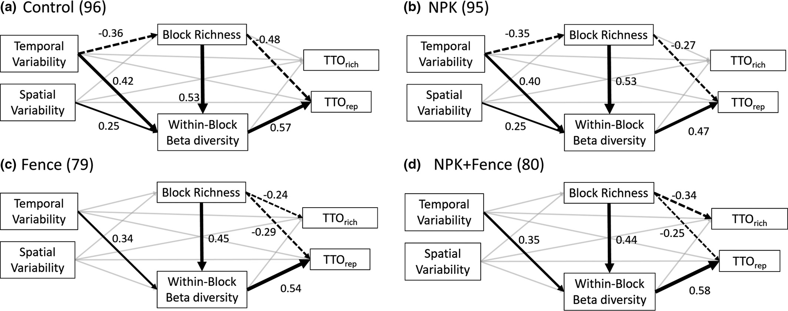{height=60%}
<!-- This figure does not show a multi-group model. Each treatment was modeled independently. Question: Is it appropriate to compare standardized coefficients between models with different datasets? In other words is the .53 in panel A the same as .53 in panel B? -->

# What can you expect to see out in nature?

{height=30%}
{height=60%}

<!-- This is one of the most well cited empirical papers using SEM in ecology. It's interesting how little they show on the actual diagram, but rather show the coefficients for a huge number of responses. Question, which paths do these coefficients map onto?  -->

# What can you expect to see out in nature?
{height=30%}
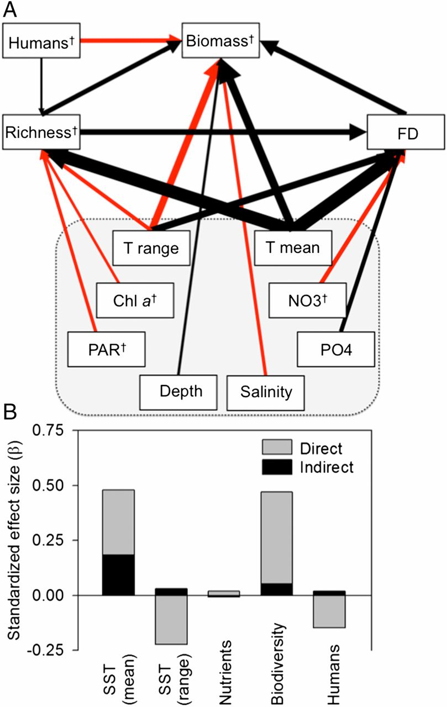{height=60%}
<!-- lots of exogenous variables, no endogenous. red = negative, black = positive. no non-significant paths? -->

# What can you expect to see out in nature?
{height=30%}
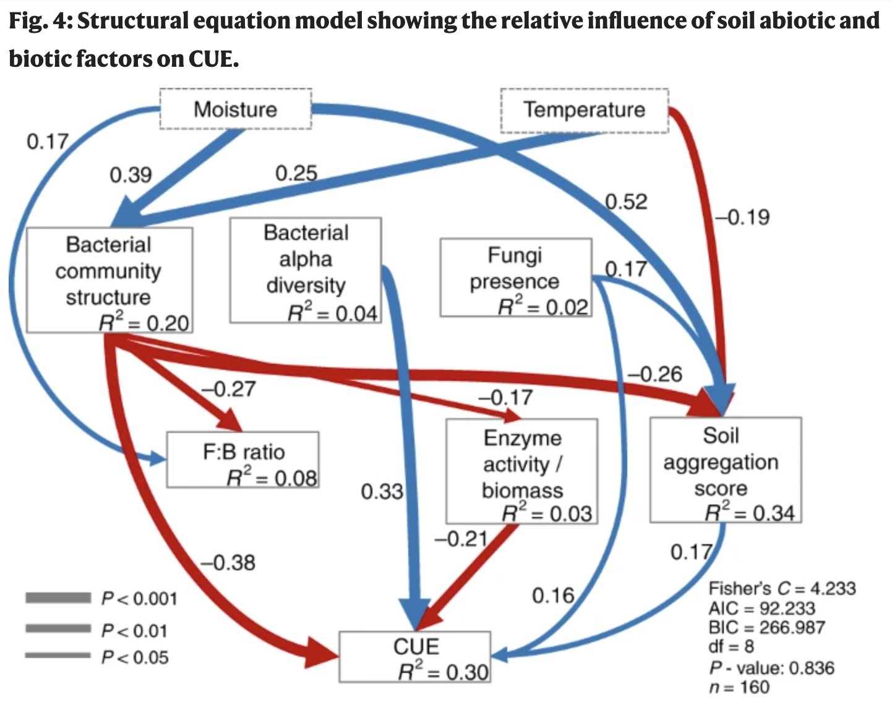{height=60%}
<!-- there is a lot of information, including path coefficients, r2, goodness of fit. path width represents p-value, which is unusual. Where are the non-significant paths? Also, notice how low some of the R2 values are -->

# What can you expect to see out in nature?
{height=30%}
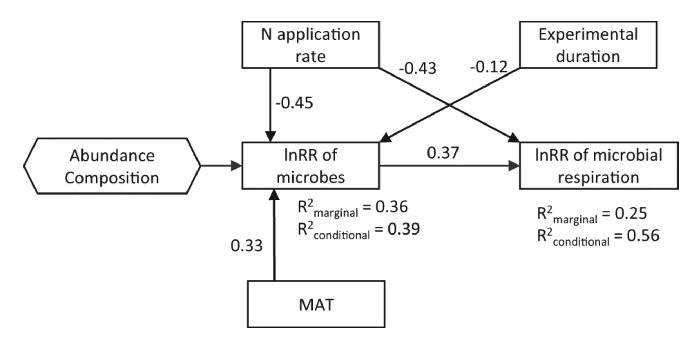{height=60%}
<!-- One really nice thing about the piecewise approach is it allows you to compare explanatory power of your fixed and random effects. What exactly does the composite represent though? -->

# What can you expect to see out in nature?
{height=30%}
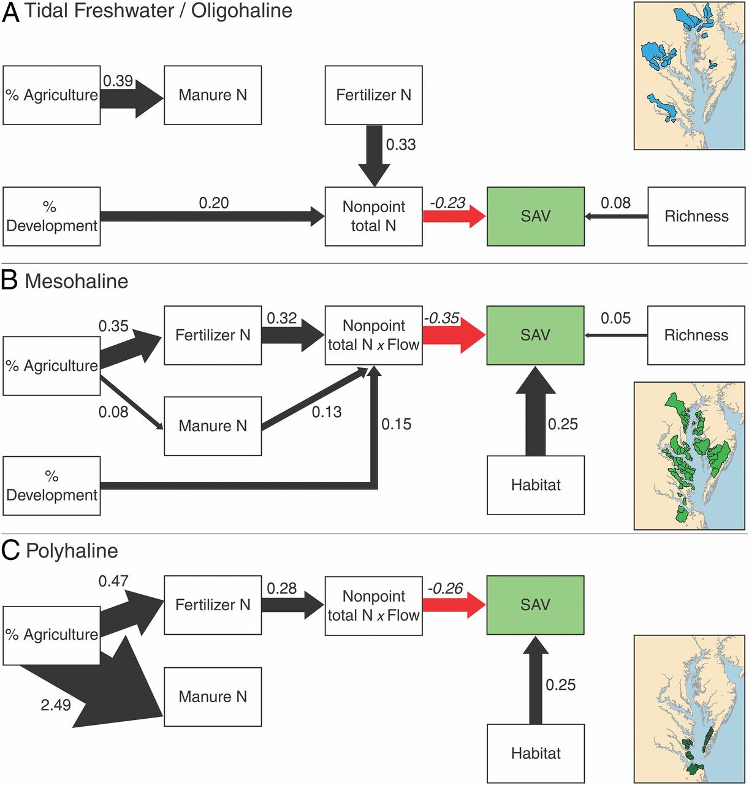{height=60%}
<!-- Use of color to highlight important paths. -->

# What can you expect to see out in nature?
{height=30%}
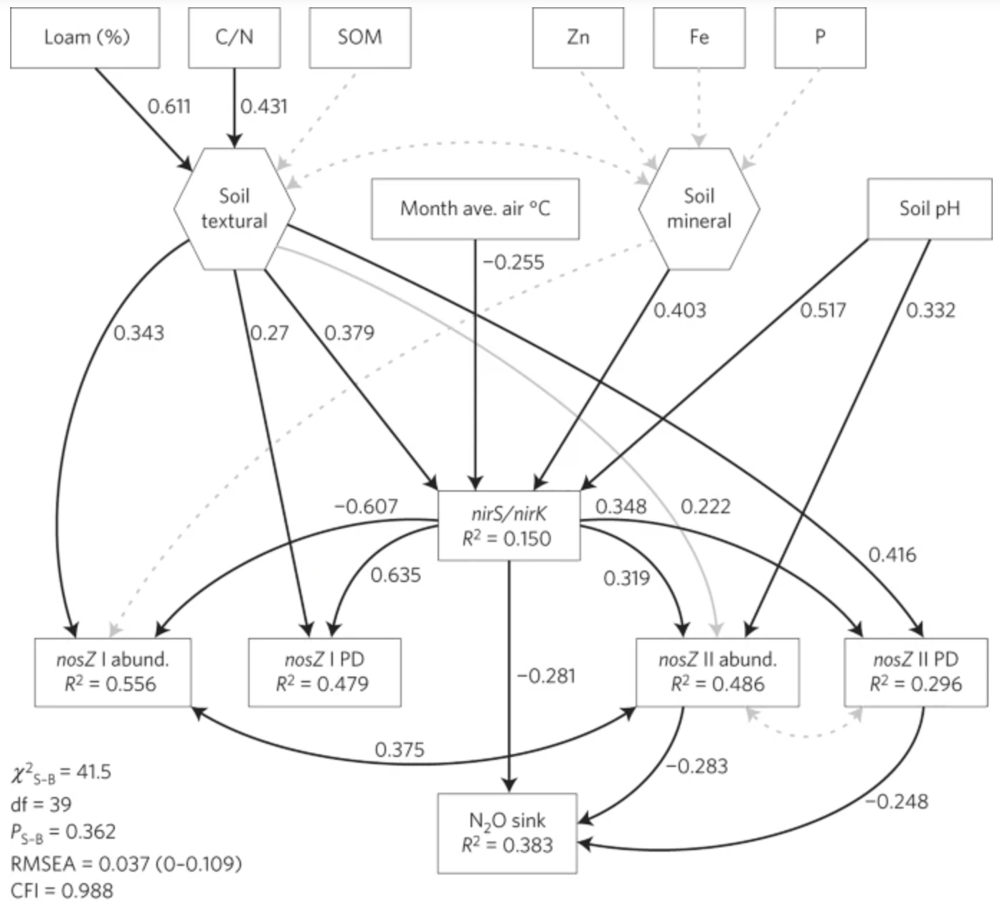{height=60%}
<!-- Lots of information. The gray, solid line is "marginally significant" (0.1 > p > 0.05) -->

# What can you expect to see out in nature?
{height=30%}
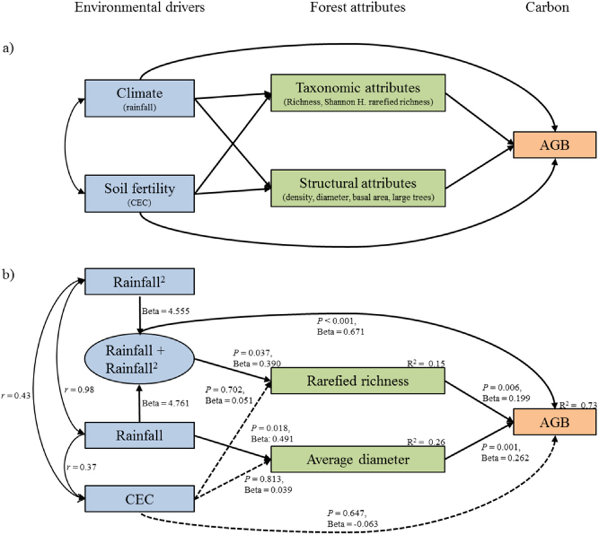{height=60%}
<!-- Use of color. Showing a conceptual model in the same figure as the data-model. Unusual way of showing a composite. -->

# What can you expect to see out in nature?
{height=30%}
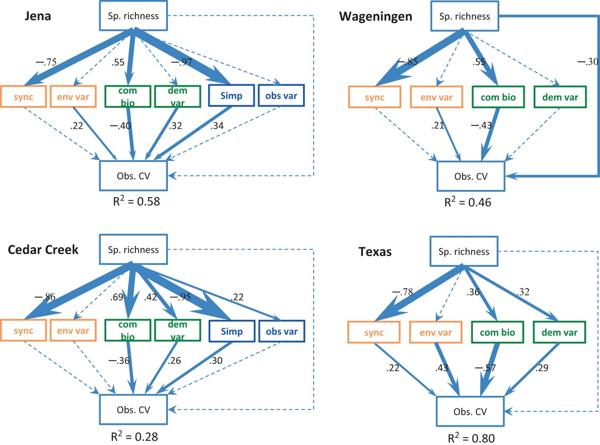{height=60%}
<!-- Unclear from the paper whether this is a multigroup model or four separate models. my intuition says it's four separate models -->

# What can you expect to see out in nature?
{height=30%}
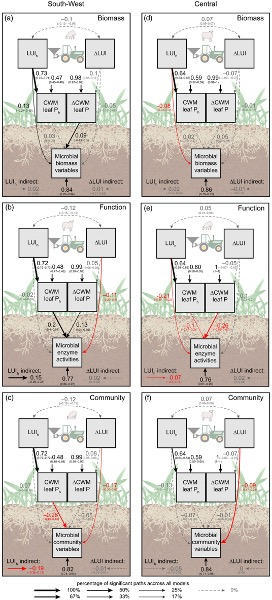{height=90%}
<!-- chart junk, hard to read, yet still a very imporant contribution to ecological literature -->

# What can you expect to see out in nature?
{height=30%}
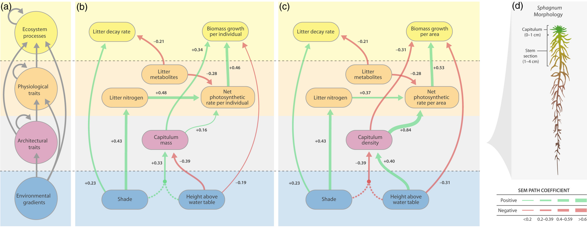{height=60%}
<!-- I love the use of color here, but why does it go from bottom to top? -->

# What can you expect to see out in nature?
{height=30%}
{height=60%}
<!-- Very high data-to-information ratio. this is a multi-group model. I like the way they show significance of paths and errors on the path coefficient estimates. They de-emphasize metrics like p-values in doing so. -->

# Discussion
## What makes a good data visualization?

# Theory

*Maybe one slide drawing on theory from people like Edward Tufte*

*Information/ink ratio*

# What is a good SEM drawing


Discussion: 

Starting from what you draw and what you just saw, what is the minimum necessary information to include in an SEM?

What is missing in your drawing?


# Necessary information

There are no rules. Here are our guidelines to help drawing a good/reproducible/interpretable SEM diagram.


1) Represent your variables
1) Represent your coefficients
1) Represent all paths 
1) Report model goodness of fit
1) Report explanatory power for endogenous variables
1) Include important tables


# Necessary information
**1) Represent your variables**

Squares are data

Circles are latent variables

Hexagon (?) for composite variables

*insert illustration*

# Necessary information
**2) Represent your coefficients**

Magnitude, direction, and significance

- Change the path

Color for direction

Dashed vs solid for significance

- Change the size

Write the numbers

*insert illustration*

# Necessary information
**3) Represent all paths **

Represent causal paths included in your model regardless of significance. 
Not necessarily in the same figure.

Represent important correlations

- Exogenous can or can not be included
- Always include correlations among the errors of endogenous variables

# Necessary information
**4) Report model goodness of fit**

- Covariance-based approaches

Chi-squared

SRMR

RMSEA

- Local estimation

D-sep test

# Necessary information
**5) Explanatory power for endogenous variables**

Residual error or R2

# Necessary information
**6) Include important tables**

Coefficient table

Local estimation: basis set?

Mediation analysis?


# Room for artistry 

This will depend on the audience and support:

Is this a paper?

Is this a presentation?

What is the narrative structure?

Key thing here is that one structure might not work in every case.
Not advocating for anything in particular, but note that the same model for a paper might not be the right presentation for an SEM.


# Room for artistry

Interactions,multigroup models, composites, etc.

Color, size, etc.

Organizing variables in space in a way that is useful to your reader rather than distracting:

- Top to bottom, or left to right?
- Mediator relative placement

Composite variable: do we need to show everything?

Breaking up complicated models into several panels or several figures

Moving information to a supplement

# Room for artistry


Meta models, apriori models, etc

- Start with something abstract (metamodel concept)
- shows the core concepts and their relationships, ignoring the data.
- The most abstracted vision of the causal process you are trying to capture


# Room for artistry

Showing the underlying data

Partial plots

Raw correlations:

- Shows linearity assumption, shows distribution of data, etc
- Correlation tables


# Building the plot 

This can be done in R. But it is generally done in external software like powerpoint, illustrator, or Inkscape.

In R, it can be useful to visualise your code and your model output.

Resources for drawing in R: <https://statistics.ohlsen-web.de/sem-path-diagram/>


