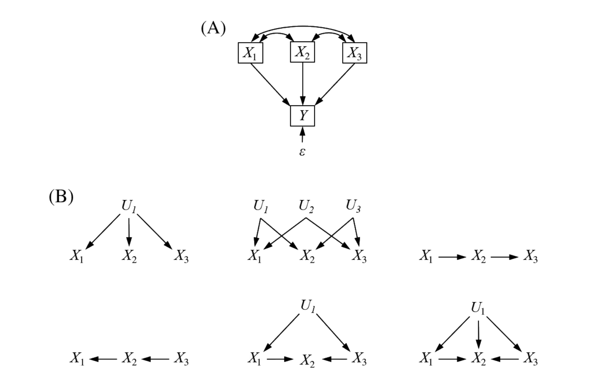

```{r setup, include=FALSE}
knitr::opts_chunk$set(echo = FALSE, fig.align='center')

library(DiagrammeR)
library(ggplot2)
library(knitr)
```

## Quick introduction of participants

-   Who are you?
-   Why do you want to learn about SEM?
-   What is your research question for day 3?

# General information

## Introduction of the **Swiss SEM team**

-   Dr. Frank Pennekamp (main instructor)\
-   Dr. James Grace (advanced topics and model clinic)\
-   Dr. Rachel Korn (course development)\
-   Dr. Noémie Pichon, Dr. Fletcher Halliday, Dr. Eliane Meier, Dr. Hugo Saiz, Dr. Debra Zuppinger-Dingley, Rebecca Oester, Annabelle Constance, Fabienne Wiederkehr (course development)

\centering

{width="50%"}

## Schedule & content

-   *Day 1*:
    -   General introduction to SEM to model ecological systems
    -   Fitting SEMs to data (live demo)
    -   Model pruning, visualization and reporting
    -   Discussion with James Grace
-   *Day 2*:
    -   Latent and composite variables
    -   Interactions
    -   Complex sampling designs
    -   Discussion with James Grace
-   *Day 3*:
    -   Self-study with possibility to meet with instructor(s)

## Overview

-   What the course is about:
    -   Global estimation with R package lavaan
    -   Hands on exercises and live coding
    -   We will work with a single, ecological dataset (Seabloom et al. 2020)
-   What will not be covered
    -   Local estimation of SEMs (with piecewiseSEM)
    -   Advanced topics like incorporating random effects, feedbacks, temporal autocorrelation

## Learning objectives

-   Participants understand the advantages and limits of SEMs to draw inferences from data
-   Participants are able to fit, interpret and visualize a SEM with `lavaan`.
-   Participants are able to apply SEM to their own dataset

# Getting started with Structural Equation Modeling

## Research questions

<!-- Comments: -->

<!-- Each slide represents a concept/topic to teach. Can be expanded to more slides. -->

<!-- Content must be revisited to be consistent in wording, concepts etc. -->

<!-- Specially required feedback on causality, meta-model, backdoor criterion, loops. -->

<!-- Concepts for technical part that could be introduced also here: global vs local, information criteria for arrow selection (for me better on technical part). -->

\centering

{width="30%"}    

- Ecology is about the relationships between organisms and their environment. 
- As ecologists, we hypothesize how things could be connected in ecological systems. 
- To test our hypotheses, we need a way to dissect when they occur for a reason versus randomness. 
- Statistics allow us to separate between signal and noise. 
- Often our research questions are about cause and effect in ecological systems. 

<!-- Ask students about their research questions -->

## Causality

\centering

{width="40%"}

-   "Correlation does not imply causation".
-   Everything else being equal, seeing variation in X leading to variation in Y.
-   Experiments to isolate effect of X on Y.
-   Experiments not always feasible, hence development of SEM.

<!-- - Explain the concept and discuss with students the topic.  -->

<!-- - Show the difference between direct effects and correlation together with the graphical representation.   -->

# Differences and similarities between SEM and regression models

## Regression models 

- Multiple observed variables.
- Only direct effects can be modelled with regression models.
- Intercorrelations between predictors usually ignored.

<!-- {width="60%"} -->

```{r, echo=F, out.width="70%", fig.align='center'}
grViz("
digraph boxes_and_circles {

  # a 'graph' statement
  graph [overlap = false, fontsize = 10, layout = dot, ranksep = .7,
       rankdir = TB]

  # 'node' statements
  node [shape = box,
        fontname = Helvetica]
  X1 [label = 'X@_{1}']
  X2 [label = 'X@_{2}']
  X3 [label = 'X@_{3}']
  Y
  E [label = '&epsilon;', shape = plaintext]
  
  # 'edge' statements
  X1 -> Y
  X2 -> Y
  X3 -> Y
  E -> Y  [minlen = .1]
  
  X1:n -> X2:n [dir=both, minlen = 5]
  X2:n -> X3:n [dir=both, minlen = 5]
  X1:n -> X3:n [dir=both, minlen = 10]
  
 # control the placement of elements on the graph 
{rank = same; X1 ; X2; X3}
{rank = max; E}

  
}
")
```


## SEM models 

-   Test and evaluate multivariate causal relationship by embracing intercorrelations (system thinking).
-   Test both direct and indirect effects on assumed causal relationships.
-   Incorporate observed and unobserved ('latent') variables.

<!-- {width="60%"} -->


```{r, echo=F, out.width="25%"}
grViz("
digraph boxes_and_circles {

  # a 'graph' statement
  graph [overlap = false, fontsize = 10, layout = dot, ranksep = .7,
       rankdir = TB]

   # 'node' statements
  node [shape = box,
        fontname = Helvetica]
  X1 [label = 'X@_{1}']
  X2 [label = 'X@_{2}']
  X3 [label = 'X@_{3}']

  # 'edge' statements
  X1 -> X2
  X2 -> X3
 # control the placement of elements on the graph 
{rank = same; X1 ; X2; X3}
}

}
")


grViz("

digraph box2 {

  # a 'graph' statement
  graph [overlap = false, fontsize = 10, layout = dot, ranksep = .7,
       rankdir = TB]

  
  # 'node' statements
  node [shape = box,
        fontname = Helvetica]
  X1 [label = 'X@_{1}']
  X2 [label = 'X@_{2}']
  X3 [label = 'X@_{3}']
  U1 [label = 'U@_{1}']

  # 'edge' statements
  U1 -> X1
  U1 -> X2
  U1 -> X3

 # control the placement of elements on the graph 
{rank = same; X1 ; X2; X3}
}
")

grViz("

digraph box2 {

  # a 'graph' statement
  graph [layout = neato, overlap = true, fontsize = 10, ranksep = .7,
       rankdir = TB]

  
  # 'node' statements
  node [shape = box,
        fontname = Helvetica]
  X1 [pos = '-4,-1!', label = 'X@_{1}']
  X2 [pos = '-3,-1!', label = 'X@_{2}']
  X3 [pos = '-2,-1!', label = 'X@_{3}']
  U1 [pos = '-3,0!' label = 'U@_{1}']

  # 'edge' statements
  U1 -> X1
  U1 -> X3
  {X3 X1} -> X2

 # control the placement of elements on the graph 
{rank = same; X1 ; X2; X3}
}
")


```


## Two goals of SEM:

1)  Understand the underlying causal network driving the correlation/covariance among a set of variables.\
2)  Explain as much of their variance as possible with the model specified.

## Explanatory modelling

{width="90%"}

## SEM modelling philosophy

-   A SEM is usually specified based on theory to determine and validify a proposed causal process and/or model.
-   Continuum between theory (hypothesis-driven) to exploratory (data-driven) modelling.\
-   Causal diagram to specify relationships.

<!-- - Importance of being aware about what the model is telling to us.   -->

<!-- - Final discussion about what SEM provides and the importance of system thinking in ecology.   -->

## Causal diagram

-   Picture of putative cause-effect relationships. 
-   Data-generating mechanisms leading to a set of observational expectations. 
-   Causal diagrams are based on directed acyclic graphs (DAGs). 

## Directed acyclic graphs

```{r, echo=F, out.width="50%", fig.align='center'}
grViz("
digraph boxes_and_circles {

  # a 'graph' statement
  graph [overlap = true, fontsize = 10, layout = dot, ranksep = equally,
       rankdir = Tb]

  # 'node' statements
  node [shape = box,
        fontname = Helvetica]
  X; Y;

  # 'edge' statements
  X -> W
  X -> Z
  W -> Y
  Z -> Y
  
 node [shape = plaintext,
        fontname = Helvetica] 
  U_w  -> W
  U_x -> X
  U_y -> Y
  U_z -> Z
  
  U_w [label = 'U@_{w}']
  U_x [label = 'U@_{x}']
  U_y [label = 'U@_{y}']
  U_z [label = 'U@_{z}']
 
 
 # control the placement of elements on the graph 
 {rank = min; U_x }
 {rank = same; Z ; W;}
 {rank = max; U_y}
 
  
}
")
```

-   Directed = unidirectional. 
-   Acyclic = no causal loops permitted.\
-   Variables are nodes (boxes).\
-   Edges (one-headed arrows) are causal relationships such as X affects Y.\
-   Omitted links and nodes have empirical implications (= assumptions about the causal diagram)


# Introduction to the dataset

## Introduction to the dataset


We will use an experimental dataset collected at the Cedar Creek Ecosystem Science Reserve to examine long-term consequences of human-driven environmental changes ecosystem responses to:

-   Disturbance\
-   Nitrogen deposition\
-   Changes in precipitation

## Introduction to the dataset

Research questions:

1)  How has aboveground biomass changed as a function of disturbance (disking) and nutrient addition?\
2)  How are these effects mediated by diversity?

## Introduction to the dataset

\centering

{width="40%"}

Location of the study site (Cedar Creek Ecosystem Science Reserve), the location of the three study fields within the reserve, and location of the 35 x 55 m intact (black) and disturbed (red) plots within each field.

## Introduction to the dataset

\centering

{width="50%"}

Location of the 4 x 4 m nutrient treatment plots within each 35 x 55 m Intact or Disturbed plot within each of three fields (A, B, and C). Letters indicate the nutrient treatments.

## Introduction to the dataset

\centering

{width="100%"}

Effect of soil disturbance (disking) and nutrient enrichment on live, aboveground plant biomass. Colors indicate nutrient addition treatment: Control and NPK+ (all nutrients plus 9.5 g N m-2 yr-1).

## Introduction to the dataset

\centering

{width="100%"} Effect of soil disturbance (disking) and nutrient enrichment on (a) diversity (ENSPIE), (b) richness (S, species 0.3 m−2), and (c) evenness (ENSPIE S−1).

## Question of interest: what is the effect of richness on biomass?

\centering

{width="70%"}

<!-- Ask students about how they would address this question. -->

## Meta-model

\centering

{width="50%"}

Meta-model are conceptual models that allow to link data with theory.

1)  Productivity (biomass) is directly influenced by the environment (nutrients, disturbance and precipitation)
2)  Productivity (biomass) is directly influenced by biodiversity (richness and evenness).
3)  The environment also influences biodiversity and thus, have an indirect effect on productivity via biodiversity.

<!-- - Thinking about what is missing in the model, measurement errors etc.  -->

<!-- - Present the concept of meta-model and impications for research.  -->

<!-- - Include a graphical representation of the meta-model as what is missing in the model.  -->

# Exercise:

## Exercise:

-   Draw a meta-model of the dataset you want to understand.
-   Make a table with putative causal relationships.

## A simple bivariate model.

\centering 

<!-- {width="50%"} -->

```{r, echo=F, out.width="50%", fig.align='center'}
grViz("
digraph boxes_and_circles {

  # a 'graph' statement
  graph [overlap = false, fontsize = 10, layout = dot, ranksep = .7,
       rankdir = TB]

   # 'node' statements
  node [shape = box,
        fontname = Helvetica]
  X1 [label = 'precipitation']
  X2 [label = 'biomass']

  # 'edge' statements
  X1 -> X2
 # control the placement of elements on the graph 
{rank = same; X1 ; X2}
}

}
")
```


\centering `lm(biomass ~ precipitation)`

-   Linear regression\
-   Regression coefficient quantifies the strength of relationship\
-   Change in Y for one unit change in X

<!-- Present the bivariate model. -->

<!-- Include the equation and a plot. -->

<!-- It is important that students understand that all they know can be defined with a graphical representation. -->

## Multiple independent variables

\centering

<!-- {width="50%"} -->

```{r, echo=F, out.width="70%", fig.align='center'}
grViz("
digraph boxes_and_circles {

  # a 'graph' statement
  graph [overlap = false, fontsize = 15, layout = neato, rankdir = LR, splines = curved]

  # 'node' statements
  node [shape = box,
        fontname = Helvetica]
  X1 [pos = '0,-1!', label = 'nutrients']
  X2 [pos = '0,-2!',label = 'precipitation']
  X3 [pos = '0,-3!',label = 'richness']
  X4 [pos = '0,-4!',label = 'evenness']
  Y  [pos = '2,-2.5!',label = 'biomass']

  # 'edge' statements
  X1 -> Y:w 
  X2 -> Y:w
  X3 -> Y:w
  X4 -> Y:w
  
  X1:w -> X2:w [constraint=false, dir=both]
  X2:w -> X3:w [dir=both]
  X1:w -> X3:w [dir=both]
  X1:w -> X4:w [dir=both]
  X2:w -> X4:w [dir=both]
  X3:w -> X4:w [dir=both]
  
}
")
```


\centering `lm(biomass ~ precipitation + nutrients + ...)`

-   More than one independent variable = multiple regression\
-   Estimates partial effects (i.e. effect of precipitation on biomass when nutrient addition is fixed)\
-   Only direct effects.

<!-- - Discuss with students other variables that may affect B.   -->

<!-- - Introduce a new variable and the question that it answers.  -->

<!-- - Add nutrient variable.  -->

<!-- - Show the graphical model (X1 -> Y, X2 -> Y).  -->

<!-- - Include the equation and the two partial plots.  -->

<!-- - Be clear this is a multiple regression model.  -->


# From regression models to SEM

## Multiple independent variables

\centering

{width="50%"}

\centering `lm(richness ~ nutrients)`\
\centering `lm(evenness ~ nutrients)`\
\centering `lm(biomass ~ richness + evenness)`

-   Indirect effect is the effect of an independent variable on a dependent variable through one or more intervening or mediating variables.\
-   Indirect effects can be quantified by the product of the compound path.

```{r, out.width="50%", fig.align='center', include=F}
grViz("
digraph boxes_and_circles {

  # a 'graph' statement
  graph [overlap = true, fontsize = 10, layout = dot, splines = curved,
       rankdir = RL]

  # several 'node' statements
  node [shape = box,
        fontname = Helvetica]
  X1; X2, Y

  # several 'edge' statements
    X1->X2[style=dashed];
    X2->Y[style=dashed];
    X1->Y;
}
")
```

## Mediation

\centering {width="40%"}

<!-- \centering {width=30%}   -->

\centering {width="40%"}

-   Tests whether a particular variable has a mediating effect on a path.\
-   Often used to test underlying mechanisms.
-   In our example, we could ask whether the effect of nutrients on biomass is mediated through biodiversity.
-   Possibilities: complete mediation, partial mediation, no mediation.

## System level approach

<!-- - Show a very complex model including multiple types of variables, arrows (direct and correlations) for the study system.  -->

<!-- - The complex model is built based on submodels, each one addressing specific questions.  -->

<!-- - We need a framework to analyze this together -> SEM  -->

<!-- - Discuss about complexity in ecology and if SEM is useful to answer your questions ("We need to do things as simple as possible, but no simpler").  -->

\centering

{width="50%"}

-   \alert{Exogenous} variables only have paths emanating from them (i.e., do not have arrows going into them).
-   \alert{Endogenous} variables have paths directed into them.
-   An endogenous variable can also have arrows directing out of it, but the sole condition is that they must be predicted.

## SEM machinery

- The building block of the global estimation procedure for SEM is the variance-covariance matrix
- Let's revisit the basics:

## SEM: variance-covariance matrix

```{r, out.width="90%", fig.align='center'}
set.seed(5)
x <- rnorm(500, sd=runif(500, 2, 50))
x2 <- 0.5 *x + rnorm(500, sd=runif(500, 2, 50))
d <- matrix(c(x,x2), 250)
pairs(d, pch = 19)
```
- Scatterplot of our variables.    


## SEM: variance-covariance matrix

\centering
```{r}
set.seed(5)
x <- rnorm(500, sd=runif(500, 2, 50))
x2 <- 0.5 *x + rnorm(500, sd=runif(500, 2, 50))
d <- matrix(c(x,x2), 250)
V <- cov(d)
kable(V)
```

- Variance: $VAR_{x}=\frac{\sum_{i=1}^{N}(x_{i}-\bar{x})}{N-1}$
  - \alert{Variance is the degree of spread in a set of data}.
- Covariance: $COV_{x,y}=\frac{\sum_{i=1}^{N}(x_{i}-\bar{x})(y_{i}-\bar{y})}{N-1}$
  - \alert{Covariance measures how much two variables are moving together}
- The variances appear along the diagonal and covariances appear in the off-diagonal elements

## SEM: correlation matrix

\centering
```{r}
set.seed(5)
x <- rnorm(500, sd=runif(500, 2, 50))
x2 <- 0.5 *x + rnorm(500, sd=runif(500, 2, 50))
d <- matrix(c(x,x2), 250)
V <- cov(d)
kable(cov2cor(V))
```

- Correlation: $COR_{x,y}=\frac{COV_{x,y}}{\sigma_x*\sigma_y}$
- Correlation matrix is standardized variance-covariance matrix

## Goodness-of-fit

- Compare the specified SEM model (given variance-covariance) to the observed variance-covariance
-   $\chi^2$ statistic: good fit when failing to reject the null hypothesis that the $\chi^2$ statistic is different from 0 \alert{(P > 0.05)}.\
-   *Comparative fit index (CFI)*: this statistic considers the deviation from a 'null' model. In most cases, the null estimates all variances but sets the covariances to 0. A value \> 0.9 is considered good.
-   *Root-mean squared error of approximation (RMSEA)*: statistic penalizes models based on sample size. A value \< 0.10 is acceptable, and anything \< 0.08 is good.\
-   *Standardized root-mean squared residual (SRMR)*: the standardized difference between the observed and predicted correlations. A value \< 0.08 is considered good.

## Assumptions of SEM with lavaan

-   (Multivariate) normality of endogenous variables
-   Global estimation based on variance-covariance matrix[^1]
-   Directed (acyclic) relationships[^2]
-   Linear relationships[^3]

[^1]: Local estimation possible.

[^2]: Causal loops possible.

[^3]: Nonlinear relationships possible.

## Model identifiability

-   Underidentified: not enough pieces of information to identify parameters uniquely (df \< 0).\
-   Saturated: Just enough information to uniquely identify parameters, but no df to check model fit (df = 0).\
-   Over-identified: parameters can be uniquely identified and positive dfs to test model goodness-of-fit (df \> 0).

## Model identifiability

"t-rule" to quickly gauge whether a model is under-, just, or overidentified:

$$ t \leq \frac{n (n + 1 )}{2} $$

*t* = number of unknowns (parameters to be estimated, i.e. variances & covariances)\
*n* = number of knowns (observed variables).

The LHS is how many pieces of information we want to know.\
RHS: information we have (number of unique cells in the observed variance-covariance matrix).

## Data requirements

-   Replication should be at least 5x the number of estimated coefficients (not error variances or other correlations).
-   To estimate two relationships, at least n = 10 required to fit model.
-   Ideally, replication is 5-20x the number of estimated parameters.
-   The larger the sample size, the more precise (unbiased) the estimates.

# Grace's 8 rules of path coefficients

## Grace's 8 rules of path coefficients
<!-- https://jslefche.github.io/sem_book/global-estimation.html -->
- The inferential heart of structural equation modeling are the regression coefficients

## Rule 1: Unspecified relationships among exogenous variables are their bivariate correlations.

If there is no directed path between two exogenous variables, their relationship is their correlation

```{r, echo=F, out.width="70%", fig.align='center'}
grViz("
digraph boxes_and_circles {

  # a 'graph' statement
  graph [overlap = false, fontsize = 15, layout = dot, rankdir = LR]

  # 'node' statements
  node [shape = box,
        fontname = Helvetica]
  X 
  Y1 
  Y2

  # 'edge' statements
  X -> Y2
  Y1 -> Y2
  X:w -> Y1:w [dir=both]
  
  {rank=same X; Y1}

}
")
```


## Rule 2: When two variables are connected by a single path, the coefficient of that path is the regression coefficient.


```{r, echo=F, out.width="70%", fig.align='center'}
grViz("
digraph boxes_and_circles {

  # a 'graph' statement
  graph [overlap = false, fontsize = 15, layout = dot, rankdir = LR]

  # 'node' statements
  node [shape = box,
        fontname = Helvetica]
  X 
  Y1 
  Y2

  # 'edge' statements
  X -> Y1 [label = '&gamma;@_{X,Y1}' ]
  Y1 -> Y2 [label = '&beta;@_{Y1,Y2}' ]


}
")
```


## Rule 3: The strength of a compound path (one that includes multiple links) is the product of the individual coefficients.


```{r, echo=F, out.width="70%", fig.align='center'}
grViz("
digraph boxes_and_circles {

  # a 'graph' statement
  graph [overlap = false, fontsize = 15, layout = dot, rankdir = TB, splines=ortho]

  # 'node' statements
  node [shape = box,
        fontname = Helvetica]
  X 
  Y1 
  Y2

  # 'edge' statements
  
  X -> Y2 [style = dashed, label = '&gamma;@_{X,Y1} * &beta;@_{Y1,Y2}' ]
  X -> Y1
  Y1 -> Y2 
  
   
  

{rank=same X; Y1, Y2}


}
")
```


## Rule 4: When variables are connected by more than one pathway, each pathway is the 'partial' regression coefficient.

- The partial regression coefficient accounts for influence of more than one variable on the response  
- In other words, the coefficient for one predictor controls for the influence of other predictors in the model   
- The coefficients of multiple regression are partial coefficients

## Rule 5: Errors on endogenous variables relate the unexplained correlations or variances arising from unmeasured variables.

- $R^{2}$: ratio of explained to total variation in response (here Y)   
- Unexplained or residual variance =  $1 - R^{2}$
- Captures other (unknown) sources causing correlation between X2 and other variables to deviate from 1.   

In a path diagram, error variances are often represented as $\zeta$ with an arrow leading into the endogenous variable. 

## Rule 6: Unanalyzed (residual) correlations among two endogenous variables are their partial correlations.

- Imagine we remove the path from Y to Y1   
- If they were exogenous variables, the relationship would be their bivariate correlation (Rule #1)    
- Here we have we have to remove the effects of X on both variables.   
- These are known as correlated errors and represented by double-headed arrows between the errors of two endogenous variables.   


```{r, echo=F, out.width="70%", fig.align='center'}
grViz("
digraph boxes_and_circles {

  # a 'graph' statement
  graph [overlap = false, fontsize = 15, layout = dot, rankdir = LR]

  # 'node' statements
  node [shape = box,
        fontname = Helvetica]
  X 
  Y1 
  Y2
  
  node [shape = plain,
        fontname = Helvetica]
  E1 [label = '&zeta;@_{Y1}'] 
  E2 [label = '&zeta;@_{Y2}'] 

  # 'edge' statements
  X -> Y1
  X -> Y2
  E1 -> Y1 
  E2 -> Y2
  E1:e -> E2:e [dir=both]

{ rank=min; X; }
  {rank=max; E1, E2}

}
")
```

## Rule 7: The total effect one variable has on another is the sum of its direct and indirect effects.

$ total = \gamma_{X, Y1} + \gamma_{Y1, Y2} + \beta_{X, Y2}$

```{r, echo=F, out.width="70%", fig.align='center'}
grViz("
digraph boxes_and_circles {

  # a 'graph' statement
  graph [overlap = false, fontsize = 15, layout = dot, rankdir = TB, splines=ortho, ranksep = .5]

  # 'node' statements
  node [shape = box,
        fontname = Helvetica]
  X 
  Y1 
  Y2

  # 'edge' statements

  
  X -> Y1 [label = '&gamma;@_{X,Y1}', minlen=3];
  Y1 -> Y2 [xlabel = '&beta;@_{Y1,Y2}', minlen=3];  
  X -> Y2 [xlabel = '&beta;@_{X,Y2}'];

  
   
{rank=same X; Y1, Y2};


}
")
```

## Rule 8: The total effect (including undirected paths) is equivalent to the total correlation.

## SEM workflow in a nutshell

1)  Review the relevant theory and research literature to support model specification
2)  Specify a model (e.g., diagram)
3)  Determine model identification
4)  Select measures for the variables represented in the model
5)  Collect data
6)  Conduct preliminary descriptive statistical analysis (e.g., scaling, missing data, collinearity issues, outlier detection)
7)  Estimate parameters in the model
8)  Assess model goodness-of-fit
9)  Check for missing or unnecessary links
10) Interpret and present results visually

# Lavaan syntax

## Lavaan syntax

Define model:

    simple <-
    "mass.above ~ nadd + rich + even + precip.mm + disk
    rich ~ nadd + precip.mm
    even ~ nadd + precip.mm"

Fit model:

    fit.simple <- sem(simple, data = seabloom)

## Lavaan syntax

| Formula type | R     | Meaning                   | Example                   |
|:-------------|:------|:--------------------------|:--------------------------|
| regression   | `~`   | is regressed on           | `y ~ x`                   |
| correlation  | `~~`  | correlate errors for      | `y1 ~~ y2`                |
| latent       | `=~`  | set reflective indicators | `Height =~ y1 + y2 + y3`  |
| composite    | `<~`  | set formative indicators  | `Comp1 <~ 1*x1 + x2 + x3` |
| intercept    | `~ 1` | estimate mean for `y`     | `y ~ 1`                   |
| labelling    | `*`   | name coefficients         | `y ~ b1*x1 + b2*x2`       |
| defining     | `:=`  | define quantity           | `Total := b1*b3 + b2`     |

# Questions?

# Live coding session

# Your turn: working with the Seabloom dataset

## Exercise 1

-   Exploration of dataset (variables and treatments)
-   Check collinearity and normality
-   Fitting linear models to estimate coefficients
    -   Multiple regression (direct effects of predictors on AGB)
    -   Multiple regression (indirect effects on richness and evenness)
    -   What can you conclude?

## Exercise 2

\centering

{width="50%"}

-   Fitting of above SEM to Seabloom data:
    -   Assess model goodness of fit.
    -   Investigate the modification indices. Are there paths to add that are reasonable?
    -   Check model summary.
    -   What can you conclude?

## Exercise 3

\centering

{width="50%"}

After finding a model with good fit:

-   Model analysis:
    -   Calculate the standardized coefficients.
    -   Add derived quantities (direct and indirect effects of nutrients and disturbance).

## Exercise 4

\centering

{width="50%"}

-   Saturated model:
    -   Model comparison with simpler models used previously.
    -   Perform model pruning.
    -   Decide on most parsimonious model and summarize model.
    -   What do you conclude?

## Exercise 5

\centering

{width="50%"}

-   Perform mediation analysis:
    -   Is the effect of disturbance mediated via its effect on richness and eveness, rather than directly on biomass?
    -   Add paths from disturbance to richness and evenness, remove the direct paths to AGB (both nutrients and disturbance).
    -   Compare model fit to simple model. What do you conclude?
