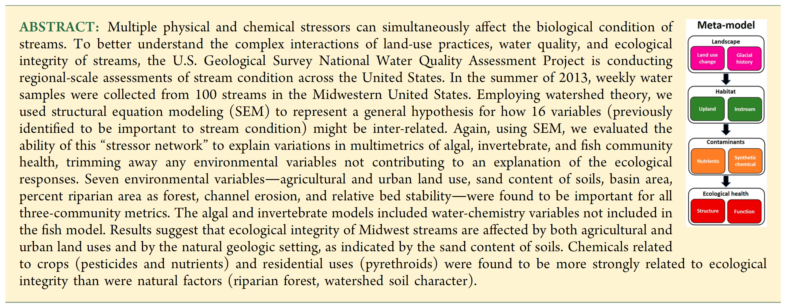
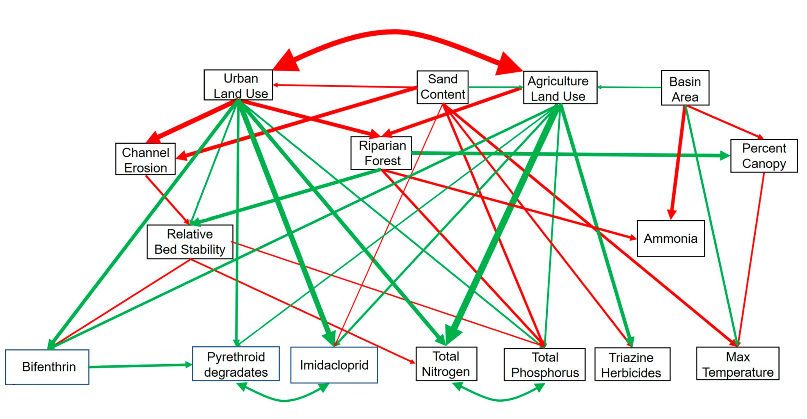

```{r setup, include=FALSE}
knitr::opts_chunk$set(echo = TRUE)
```

## Introduction^[Schmidt, T.S., Van Metre, P.C., Carlisle, D.M. (2019). Linking the Agricultural Landscape of the Midwest to Stream Health with Structural Equation Modeling. _Environmental Science Technology_, _53_, 452-462. https://doi.org/10.1021/acs.est.8b04381]

The expanding human population as well as their actions on the landscape (e.g. developments in infrastructure, agriculture, and industry) threaten the ecological integrity of stream ecosystems. Understanding how these landscape modifications affect the stream habitat, water quality, and ultimately stream biology, is a primary goal of stream ecology and crucial for the development of effective management strategies that maintain our freshwater resources.

For background, we here provide the abstract from their paper. Please refer to the study for more details. 

## Data Exploration

Schmidt et al. (2019) performed all modelling in R using the packages `psych`, `data.table`, `lavaan`, and `semPlot`, thus we, too, will (install and) load them. If you are not yet familiar with these packages, use the built-in help function (e.g. `?lavaan`) to find out more about them. The authors provide their data and metadata [here](https://www.sciencebase.gov/catalog/item/5b463148e4b060350a15a836)^[https://www.sciencebase.gov/catalog/item/5b463148e4b060350a15a836], and the supplementary material [here](https://pubs.acs.org/doi/suppl/10.1021/acs.est.8b04381/suppl_file/es8b04381_si_001.pdf)^[https://pubs.acs.org/doi/suppl/10.1021/acs.est.8b04381/suppl_file/es8b04381_si_001.pdf]. We will download the data and get started in R:

```{r, include=FALSE}
# Load packages
require(psych)
require(data.table)
require(lavaan)
require(semPlot)
require(AICcmodavg)
```

```{r}
# Set working directory and load data
setwd("~/Git_Projects/Swiss_SEM/Case_Studies/Schmidt-et-al_2019")
dat <- read.csv("Schmidt-et-al_2019.csv", sep = ";")
```

First, we need to inspect and transform the data to meet the assumptions of normality and heterogeneity of variance. Data scales impact the internal matrix manipulations. `lavaan` is fussy about data scales, since they impact the internal matrix manipulations. Although it will let us know if it has a problem with our data, it is good practice to inspect the data beforehands. The authors of this study list the specific transformations for predictor variables in Table S1, and those for the ecology variables in the main text. We transform the data accordingly:

```{r}
# Transform data
dat2 <- dat # duplicate data to avoid overwriting original data
dat2$BasinArea <- log10(dat$BasinArea) # example for how to log10-transform variable
```

```{r, echo=FALSE}
# Data transformations
dat2$BasinArea <- log10(dat$BasinArea) #Basin Area
dat2$Bank <- log10(dat$Bank+1) #Channel Erosion
dat2$PctCanopy <- asin(sqrt(dat$PctCanopy/100)) #Percent Canopy
dat2$RBS <- dat$RBS^(1/4) #Relative Bed Stability
dat2$Bifenthrin <- log10(dat$Bifenthrin+1) #Bifenthrin
dat2$imidacloprid <- log10(dat$imidacloprid+1) #Imidacloprid
dat2$pyrethroid_deg_sum <- log10(dat$pyrethroid_deg_sum+1) #Pyrethroid Degradates
dat2$triazH <- log10(dat$median.of.sumconcn_triazH+1) #Triazine Herbizides
dat2$NH3_MED_42DAY <- log10(dat$NH3_MED_42DAY+1) #Ammonia
dat2$TN_MED_42DAY <- log10(dat$TN_MED_42DAY) #Total Nitrogen
dat2$TP_MED_42DAY <- log10(dat$TP_MED_42DAY) #Total Phosphorus
dat2$BC_2.RelAbun <- dat$BC_2.RelAbun^(1/4) #BC2, integrity of algal community
dat2$BC_3.RelAbun <- dat$BC_3.RelAbun^(1/2) #BC3, integrity of algal community
dat2$BC_4.RelAbun <- dat$BC_4.RelAbun^(1/2) #BC4, integrity of algal community
```

After transformation, the data need to be centred and standardised "by subtracting the mean value for each variable from each observation and then dividing by the standard deviation of all observations for that variable". Luckily, this is just what the function `scale()` does:

```{r}
# Centre and standardise data
dat3 <- data.table(scale(dat2[,-1])) # scale() function returns matrix, thus we apply data.table() function
```

## Model Building
We are now ready to build our first model. `lavaan` uses a specific model syntax to describe structural equation models. Use the built-in help function `?model.syntax` and consult the section "Details" for more information. In their first model, the authors evaluated how land-use and natural landscape features, riparian and instream habitat variables, nutrients, and chemicals were inter-related. They spent weeks going through an exhaustive yet realistic set of model scenarios to come up with a final stressor model. For the sake of time, we will sneak a peek at this final model. This is not cheating, exactly, since SEM is an explanatory framework for developing and evaluating complex hypotheses about systems---let us assume we did a very thorough literature search and came up with this model: 
In `lavaan`, there are three steps we need to take:

|         Step 1: Specify model
|         Step 2: Estimate/fit model
|         Step 3: Extract results (both estimates and assessment of fit)
|   
|  
Specifying a model simply involves an equation for each response variable in the model:

```{r}
# Step 1: Specify model
mod.stressor<-'
  # Regressions
  UrbanTotal2011 ~ SandContent
  AgricultureTotal2011 ~ SandContent + BasinArea
  Bank ~ UrbanTotal2011 + SandContent
  r50_ForestTotal2011 ~ UrbanTotal2011 + AgricultureTotal2011
  PctCanopy ~ BasinArea + r50_ForestTotal2011
  RBS ~ UrbanTotal2011 + Bank + r50_ForestTotal2011
  NH3_MED_42DAY ~ BasinArea + r50_ForestTotal2011
  Bifenthrin ~ UrbanTotal2011 + AgricultureTotal2011 + RBS
  pyrethroid_deg_sum ~ UrbanTotal2011 + AgricultureTotal2011 + Bifenthrin
  imidacloprid ~ UrbanTotal2011 + SandContent + AgricultureTotal2011
  TN_MED_42DAY ~ UrbanTotal2011 + AgricultureTotal2011 + RBS
  TP_MED_42DAY ~ UrbanTotal2011 + SandContent + AgricultureTotal2011 + r50_ForestTotal2011 + RBS
  triazH ~ SandContent + AgricultureTotal2011
  Tmax42.C.OBSYN ~ SandContent + BasinArea + PctCanopy
  
  # Covariances
  UrbanTotal2011 ~~ AgricultureTotal2011
  pyrethroid_deg_sum ~~ imidacloprid
  TN_MED_42DAY ~~ TP_MED_42DAY
' # note that we renamed dat3$median.of.sumconcn_triazH to dat3$triazH for simplicity

# Step 2: Estimate model
fit.mod.stressor <- sem(mod.stressor, data = dat3, fixed.x = FALSE, estimator = "MLM") # sem() is used to fit model
# note: listwise deletion of missing values is the default setting; fixed.x=FALSE is used to treat exogenous means, variances, and covariances as random; estimator="MLM" to use maximum likelihood estimation with robust errors to offset any bias introduced by non-normal distribution

# Step 3: Extract results
summary(fit.mod.stressor, standardized = TRUE, fit.measures = TRUE, rsquare = TRUE)
fitMeasures(fit.mod.stressor, c("cfi", "rni", "rmsea", "srmr", "ifi"))
```

Great, the fit of our hypothesised model is good in general terms. But are we missing any important links? Modification indices measure the distance between fitted and implied covariance matrices and suggest additional paths that could improve model fit. Here, we are interested in modification indices > 4:

```{r}
# Request modification indices
m.i <- modindices(fit.mod.stressor, standardized = FALSE); print(m.i[m.i$mi > 4,])

```

Could there exist a path between 'Urban Land Use' and 'Percent Canopy', or between 'Urban Land Use' and 'Max Temperature'? We add these two paths to two separate models and run them both.

```{r, include=FALSE}
mod.stressor.2<-'
  # Regressions
  UrbanTotal2011 ~ SandContent
  AgricultureTotal2011 ~ SandContent + BasinArea
  Bank ~ UrbanTotal2011 + SandContent
  r50_ForestTotal2011 ~ UrbanTotal2011 + AgricultureTotal2011
  PctCanopy ~ BasinArea + r50_ForestTotal2011 + UrbanTotal2011
  RBS ~ UrbanTotal2011 + Bank + r50_ForestTotal2011
  NH3_MED_42DAY ~ BasinArea + r50_ForestTotal2011
  Bifenthrin ~ UrbanTotal2011 + AgricultureTotal2011 + RBS
  pyrethroid_deg_sum ~ UrbanTotal2011 + AgricultureTotal2011 + Bifenthrin
  imidacloprid ~ UrbanTotal2011 + SandContent + AgricultureTotal2011
  TN_MED_42DAY ~ UrbanTotal2011 + AgricultureTotal2011 + RBS
  TP_MED_42DAY ~ UrbanTotal2011 + SandContent + AgricultureTotal2011 + r50_ForestTotal2011 + RBS
  triazH ~ SandContent + AgricultureTotal2011
  Tmax42.C.OBSYN ~ SandContent + BasinArea + PctCanopy
  
  # Covariances
  UrbanTotal2011 ~~ AgricultureTotal2011
  pyrethroid_deg_sum ~~ imidacloprid
  TN_MED_42DAY ~~ TP_MED_42DAY
' # note that we renamed dat3$median.of.sumconcn_triazH to dat3$triazH for simplicity

fit.mod.stressor.2 <- sem(mod.stressor.2, data = dat3, fixed.x = FALSE, estimator = "MLM")

mod.stressor.3<-'
  # Regressions
  UrbanTotal2011 ~ SandContent
  AgricultureTotal2011 ~ SandContent + BasinArea
  Bank ~ UrbanTotal2011 + SandContent
  r50_ForestTotal2011 ~ UrbanTotal2011 + AgricultureTotal2011
  PctCanopy ~ BasinArea + r50_ForestTotal2011
  RBS ~ UrbanTotal2011 + Bank + r50_ForestTotal2011
  NH3_MED_42DAY ~ BasinArea + r50_ForestTotal2011
  Bifenthrin ~ UrbanTotal2011 + AgricultureTotal2011 + RBS
  pyrethroid_deg_sum ~ UrbanTotal2011 + AgricultureTotal2011 + Bifenthrin
  imidacloprid ~ UrbanTotal2011 + SandContent + AgricultureTotal2011
  TN_MED_42DAY ~ UrbanTotal2011 + AgricultureTotal2011 + RBS
  TP_MED_42DAY ~ UrbanTotal2011 + SandContent + AgricultureTotal2011 + r50_ForestTotal2011 + RBS
  triazH ~ SandContent + AgricultureTotal2011
  Tmax42.C.OBSYN ~ SandContent + BasinArea + PctCanopy + UrbanTotal2011
  
  # Covariances
  UrbanTotal2011 ~~ AgricultureTotal2011
  pyrethroid_deg_sum ~~ imidacloprid
  TN_MED_42DAY ~~ TP_MED_42DAY
' # note that we renamed dat3$median.of.sumconcn_triazH to dat3$triazH for simplicity

fit.mod.stressor.3 <- sem(mod.stressor.3, data = dat3, fixed.x = FALSE, estimator = "MLM")
```

We compare the three models using AIC~C~. For this, we (install and) load the package `AICcmodavg` and use the function `aictab()`:

```{r}
aictab(list(fit.mod.stressor,fit.mod.stressor.2,fit.mod.stressor.3),c("Model 1","Model 2","Model 3"))
```

This approach selects our first model. Once the authors were happy with their model, they went over to a robust fit approach using Bollen-Stine bootstrap (_n_ = 1000). Since the data set is relatively small (only 98 observations) compared to how complicated the model is, they were concerned that the MLM approach might find significant path coefficients not supported by the robust approach. Thus, they only included paths that were significant using the MLM and robust fits. We can run a Bollen-Stine bootstrap SEM by adding the term `test = "bollen.stine, se = "boot", bootstrap = 1000`. This may take a while:

```{r}
# Bollen-Stine bootstrap
mod.stressor.bs<-sem(mod.stressor, data = dat3, test = "bollen.stine", se = "boot", bootstrap = 1000, fixed.x = FALSE)
standardizedSolution(mod.stressor.bs)
```