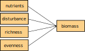

```{r setup, include=FALSE}
knitr::opts_chunk$set(echo = TRUE)
```


# SEM basics
## What dataset to use, properties of data?


## Metamodel
{width=70%}


## Load data
```{r}
rm(list = ls())
data <- read.table("~/Swiss_SEM/data_preparation/CedarCreek_Seabloom/seabloom-2020-ele-dryad-data/cdr-e001-e002-output-data.csv",
                       sep=",", header=TRUE)
```


## Subset to one year
```{r}
data <- data[data$year == 2000, ]
```


## Linear model
- visualisation as DAG
- residuals
- variance/covariance matrix

{width=70%}

```{r}
lm1 <- lm(mass.above ~ nadd + rich + even + disk,  data = data)
summary(lm1)
plot(lm1)
```


## SEM, very simple example (same variables as in LM) 
- visualisation as DAG
- explain model output
- assessment of fit

{width=70%}


```{r}
library("lavaan")

sem1 <-
"mass.above ~ nadd + rich + even + disk
rich ~ nadd
even ~ nadd"

fit.sem1 <- sem(sem1, data = data)
```


### Scale variables
To reduce the difference in variances between the variables, we rescale them setting the mean to zero and the variance to one.
```{r}
data[, c(4, 7, 13:15)] <- apply(data[, c(4, 7, 13:15)], 2, scale)


fit.sem1 <- sem(sem1, data = data)
summary(fit.sem1, rsq = TRUE)
```


The model converged with poor fit:
- The ratio of the test statistic and the degrees of freedem should be **smaller than 2** (this ratio gives an indication how far away the model is from a decent fit)
- p-value should be larger than 0.05


### Modification indices
To improve the model we look for missing paths.

```{r}
modindices(fit.sem1, minimum.value = 3)
```

In the column `mi` (modification index) we look for high values...
Highest values are between `rich` and `even` and therefore, we include a correlation between them.

```{r}
fit.sem1.up <- update(fit.sem1, add = "rich ~~ even")
summary(fit.sem1.up, rsq = TRUE, fit.measures=T)

# standardizedsolution(fit.sem1.up)
# inspect(fit.sem1.up, "r2")

library(lavaanPlot)
lavaanPlot(model = fit.sem1.up, node_options = list(shape = "box", fontname = "Helvetica"), edge_options = list(color = "grey"), coefs = T, stand = FALSE, sig = 0.05)
```


### Simple model: Random terms with piecewiseSEM

We can do the same in piecewiseSEM. The advantage is that we can include some random structure in the model. Let's take a look first at the model without random terms.

```{r}
library(piecewiseSEM)
library(nlme)

Psem1List <- list(
  lm(mass.above ~ rich + even + nadd + disk, data),
  lm(rich ~ nadd, data),
  lm(even ~ nadd, data),
  even %~~% rich
)


Psem1 <- as.psem(Psem1List)
summary(Psem1, .progressBar = F)
```

We see that the model fit is good (because we included the correlation between richness and evenness' errors).
The data was collected in plots within fields, whch adds a block effect to our structure. Let's try out with the random term.

```{r}

Psem1RandomList <- list(
  lme(mass.above ~ rich + even + nadd + disk, random = ~ 1|field, data),
  lme(rich ~ nadd, random = ~ 1|field, data),
  lme(even ~ nadd, random = ~ 1|field, data),
  even %~~% rich
)


Psem1Random <- as.psem(Psem1RandomList)
summary(Psem1Random, .progressBar = F)
```

We see here that the richness effect on biomass became non-significant.

### Simple model: Random terms with lavaan

```{r}

# modfit<-sem(model, data=dat, estimator = "mlm")
# survey.design <- svydesign(ids=~1, strata = ~ spatial_block, prob =~1, data=dat)
# fit_with_blocks <- lavaan.survey(modfit, survey.design)
# summary(fit_with_blocks, rsquare=T, standardized = T, fit.measures = T)


library(survey)
library(lavaan.survey)

modfit<-sem(model=fit.sem1.up, data=data, estimator = "mlm")
survey.design <- svydesign(ids=~1, strata = ~ field, prob =~1, data=data)
fit_with_blocks <- lavaan.survey(modfit, survey.design)
summary(fit_with_blocks, rsquare=T, standardized = T, fit.measures = T)

```


## Saturated model
{width=70%}

```{r}
sem2 <-
"mass.above ~ nadd + rich + even + disk
rich ~ nadd + disk
even ~ nadd + disk

rich ~~ even"

fit.sem2 <- sem(sem2, data = data)
summary(fit.sem2, rsq = TRUE)
```


```{r}
modindices(fit.sem2, minimum.value = 3)
```
The modification indices shows that the model is saturated and thus, no further paths can be added to improve the model fit.


### Saturated model: Random terms with piecewiseSEM

Let's try again to add the random structure an compare lavaan and piecewise outputs.

```{r}

Psem2RandomList <- list(
  lme(mass.above ~ rich + even + nadd + disk, random = ~ 1|field, data),
  lme(rich ~ nadd + disk, random = ~ 1|field, data),
  lme(even ~ nadd + disk, random = ~ 1|field, data),
  even %~~% rich
)

Psem2Random <- as.psem(Psem2RandomList)
summary(Psem2Random, .progressBar = F)

```


### Pruning
```{r}
sem.prune <-
"mass.above ~ nadd + rich
rich ~ nadd
even ~ nadd 

rich ~~ even"

fit.sem.prune <- sem(sem.prune, data = data)
summary(fit.sem.prune)
```


## Model comparison
- add an additional variable or path, then compare the two SEM


## SEM with latent and composite variables
- difference between latent and composite variable
- SEM with latent variable(s)
- SEM with composite variable(s)

{width=70%}

# SEM with latent variable "diversity"

```{r}
sem2 <-"
# Latent variable definition
diversity =~ rich + even

mass.above ~ nadd + diversity + disk
diversity ~ nadd
"

fit.sem2 <- sem(sem2, data = data)
summary(fit.sem2)

```

# SEM with composite variable "land use intensity"

```{r}
compositeModel<-'
    #1) define the composite, scale to logN
    Nitrogen ~ 1*logN + logNcen2 #loading on the significant path!
 
    #2) Specify 0 error variance
    Nitrogen ~~ 0*Nitrogen
 
      #3) now, because we need to represent this as a latent variable
      #show how species richness is an _indicator_ of nitrogen
      Nitrogen =~ SA
 
    #4) BUT, make sure the variance of SA is estimated
      SA ~~ SA
 
    #Regional Richness also has an effect
    SA ~ SR
 
    #And account for the derivation of the square term from the linear term
    logNcen2 ~ logN
      '
 
 # we specify std.lv=T so that the Nitrogen-SA relationship isn't fixed to 1
 compositeFit <- sem(compositeModel, data=cards, std.lv=T)

``` 
 

## SEM with interaction
{width=70%}


## SEM with autocorrelation (temporal, spatial) --> advanced?


